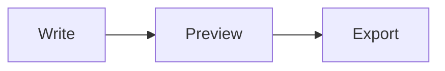

# 🧪 Markups — COMPLETE MANUAL TEST (har fix ke liye)

> Sab kuch editor mein paste karo (Ctrl+V) aur section by section test karo.
> Har section ka **KYA KARNA** + **KYA DEKHNA CHAHIYE**.

---

## ✅ TEST 1 — EMOJI (#45)

**Karna:** Neeche type karo, enter karo.

:smile:  :+1:  :fire:  :heart:  :rocket:  :tada:

**Dekhna:** Sab GitHub-exact emoji render ho: 😄 👍 🔥 ❤️ 🚀 🎉

Ab type karo ek **unknown** shortcode:

:xyz_not_exist:  :hover_123:

**Dekhna:** Ye **literal hi rehna chahiye** (galat random emoji NAHI). `:time:` type karo — `{time}` tag hi rehna chahiye.

- [ ] Emoji GitHub-exact render
- [ ] Unknown shortcode literal rah gaya (galat emoji nahi)

---

## ✅ TEST 2 — XML SYNTAX (#42)

**Dekhna:** Neeche code block mein **color** dikhna chahiye — tag blue, attribute purple/red. Sab black NAHI.

```xml
<?xml version="1.0" encoding="UTF-8"?>
<Query Name="test" Timing="4" Flag="1">
  <Condition operation="gt" value="10" />
  <Note>This is a &amp; test &lt;xml&gt;</Note>
</Query>
```

Ab **uppercase XML** bhi try karo (case-insensitive chahiye):

```XML
<Query Name="capital" Timing="1" />
```

- [ ] `<Query>` tag color mein
- [ ] `Name`/`Timing` attribute color mein
- [ ] `&amp;` entity highlighted
- [ ] Uppercase ```XML``` kaam kiya

---

## ✅ TEST 3 — INI SYNTAX (#44)

**Dekhna:** `[Section]` + key + value **color-coded**, black nahi.

```ini
[Server]
host = 127.0.0.1
port = 8080
enable_gzip = true

[Database]
type = mysql
name = markups
```

- [ ] `[Server]` heading color mein
- [ ] `host`, `port`, `type` keys color mein
- [ ] values `127.0.0.1`, `8080` color mein

---

## ✅ TEST 4 — SYNC SCROLL (#39) → TALL TABLE

**Karna:** Editor scroll karo / sourcel mein niche jao. Preview bhi saath scroll karna chahiye.

| Flag | Name | Description | Status | Value | Owner | Priority | Notes |
|------|------|-------------|--------|-------|-------|----------|-------|
| 🇮🇳 1 | Alpha | First row details go here | Open | 10 | Abhay | High | Some note here |
| 🇮🇳 2 | Bravo | Second row details go here | Open | 20 | Abhay | High | Some note here |
| 🇮🇳 3 | Charlie | Third row details go here | Open | 30 | Abhay | Mid | Some note here |
| 🇮🇳 4 | Delta | Fourth row details go here | Closed | 40 | Abhay | Low | Some note here |
| 🇮🇳 5 | Echo | Fifth row details go here | Open | 50 | Abhay | High | Some note here |
| 🇮🇳 6 | Foxtrot | Sixth row details go here | Open | 60 | Abhay | Mid | Some note here |
| 🇮🇳 7 | Golf | Seventh row details go here | Closed | 70 | Abhay | Low | Some note here |
| 🇮🇳 8 | Hotel | Eighth row details go here | Open | 80 | Abhay | High | Some note here |
| 🇮🇳 9 | India | Ninth row details go here | Open | 90 | Abhay | Mid | Some note here |
| 🇮🇳 10 | Juliet | Tenth row details go here | Open | 100 | Abhay | High | Some note here |
| 🇮🇳 11 | Kilo | Eleventh row details go here | Closed | 110 | Abhay | Low | Some note here |
| 🇮🇳 12 | Lima | Twelfth row details go here | Open | 120 | Abhay | Mid | Some note here |
| 🇮🇳 13 | Mike | Thirteenth row details go here | Open | 130 | Abhay | High | Some note here |
| 🇮🇳 14 | November | Fourteenth row details go here | Closed | 140 | Abhay | Low | Some note here |
| 🇮🇳 15 | Oscar | Fifteenth row details go here | Open | 150 | Abhay | Mid | Some note here |
| 🇮🇳 16 | Papa | Sixteenth row details go here | Open | 160 | Abhay | High | Some note here |
| 🇮🇳 17 | Quebec | Seventeenth row details go here | Open | 170 | Abhay | Mid | Some note here |
| 🇮🇳 18 | Romeo | Eighteenth row details go here | Closed | 180 | Abhay | Low | Some note here |

---

> ### 🔽 YE NEEche KA CREDIT TEXT TAK Preview jaana CHAHIYE (issue #39 ka proof)
> Agar is text tak scroll hota hai bina atke = **scroll-sync theek hai**. Agar 86% pe atak jaye = fix nai chala.

---

## ✅ TEST 5 — VIDEO EMBED (#40 + hot-reload fix)

**A) Explicit embed tag — video CHALE:** (net chahiye)

{video mode=embed}(https://interactive-examples.mdn.mozilla.net/media/cc0-videos/flower.mp4)

**B) GitHub image link — IMAGE dikhni chahiye, dead "Open video" NAHI:**
(Mera test asset 404 karega, lekin wo **image** rehna chahiye, galat video label NAHI.)


**C) ⭐ VIDEO HOT-RELOAD TEST (sabse important naya fix):**
- Player ke saamne ek paragraph rakho.
- **Video pe click karke PLAY karo** (ya use thoda load hone do).
- Phir **nikaali jagah type karo** (koi aur paragraph), bar-bar.
- **DEKHNA:** Video **reload/flicker na ho** — same video wahi rahe, na wapas chale, na "loading" ho. *Pehle har keystroke pe reload hota tha.*

- [ ] {video mode=embed} wala chala (video plays)
- [ ] GitHub image-link picture bani (dead "Open video" nahi)
- [ ] Typing se video reload/flicker NAHI hua ⭐

---

## ✅ TEST 6 — DOUBLE-PARAGRAPH (document/mode switch fix)

**Karna (ye wahi bug tha):**
1. Koi paragraph edit karo (editor ya preview mein).
2. Fir **view switch** karo: Write (`view-code`) → Split → Preview → wapas.
3. Ya **Document mode** toggle dabao, kuch type karo, wapas aao.
4. **DEKHNA:** paragraph **DOUBLE na ho** — ek hi baar dikhe. (Pehle double ho jata tha.)

- [ ] Switch ke baad paragraph DOUBLE nahi hua
- [ ] Content wahi bacha (koi duplication nahi)

---

## ✅ TEST 7 — SANITY (baaki sab normal chale)

### Heading aur list
- ek
- do
- teen

### Mermaid diagram


### KaTeX math
Inline math $x^2 + y^2$ works. Block:
$$\sum_{i=1}^{n} i = \frac{n(n+1)}{2}$$

### Blockquote
> Best way to predict the future is to create it.

- [ ] Mermaid render hua
- [ ] KaTeX render hua
- [ ] Normal headings/list/quote theek

---

## 📋 FINAL CHECKLIST (apne liye)

| # | Fix | Pass? |
|---|-----|-------|
| 1 | Emoji #45 | ☐ |
| 2 | XML #42 | ☐ |
| 3 | INI #44 | ☐ |
| 4 | Scroll-sync #39 (bottom tak) | ☐ |
| 5a | Video embed #40 | ☐ |
| 5b | GitHub image correct | ☐ |
| 5c | Video hot-reload (no flicker) | ☐ |
| 6 | Double-paragraph | ☐ |
| 7 | Sanity (mermaid/katex) | ☐ |
