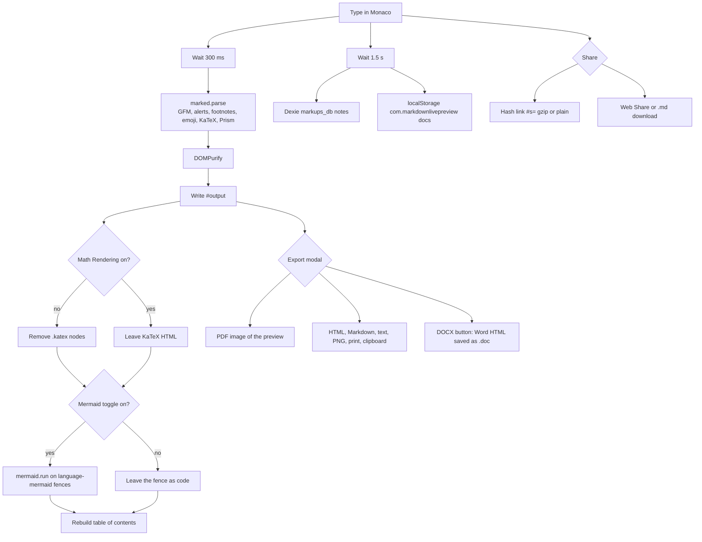

# Markups

Free browser Markdown editor with a live preview. The editor is Monaco. Parsing, sanitizing, diagram rendering, PDF export, and saving all run in the page. There is no account and no paywall on [markups.dev](https://markups.dev/).

- **Live app:** [https://markups.dev/](https://markups.dev/)
- **Source:** [https://github.com/Nir-Bhay/markups](https://github.com/Nir-Bhay/markups)
- **License:** [MIT](LICENSE)

The hosted site loads `src/main.js` (Vite's default entry). `src/app.js` is a second boot path used only when you build with `--mode modular`. Behavior below is the production path, checked against the source and against the HTML, CSS, and JS currently served at markups.dev.

## What it is for

Open the site and write. A preview pane updates after you pause typing. Notes stay in this browser until you download a file or build a share link.

It fits README drafts, notes with tables and task lists, math, and Mermaid diagrams, without installing a desktop app. It is a single-user editor. It is not a hosted wiki, not a multiplayer document, and not a folder of Markdown files on disk the way Obsidian or Typora is.

## Editing

The editor is created with `monaco.editor.create` on `#editor`, language `markdown`, word wrap on, minimap off. Three toolbar buttons switch the layout:

| Button | Body class | What you see |
|---|---|---|
| Write | `view-editor` | Source only |
| Split | `view-split` | Source and preview, with a draggable divider |
| Preview | `view-preview` | Rendered document only |

Scroll sync is a toolbar toggle (`#scroll-sync-button`) backed by `src/utils/scroll-sync.js`. It maps editor lines to preview nodes instead of using a single scroll ratio. The choice is stored in localStorage.

Settings → Editor can change font size, line height, tab size, word wrap, line numbers, minimap, bracket matching, and keybindings (Default or Vim). Choosing Vim dynamically imports `monaco-vim` and shows the mode in `#vim-status`. If that import fails, the setting is put back to Default.

The theme grid in Settings is VS Light, GitHub Light, Solarized Light, VS Dark, GitHub Dark, Dracula, and Solarized Dark. A separate header control toggles the light/dark UI. Ctrl/Cmd+D does **not** walk that grid. The handler in `setupKeyboardShortcuts` cycles only `vs`, `vs-dark`, and `hc-black`.

Other controls that are on the page and wired in `src/main.js`:

- **Tabs and a file explorer.** Notes are files in an in-browser tree (folders and files). The explorer can create, rename, delete, and move nodes. The active tab id is remembered in `localStorage` under `markups_last_active_tab`.
- **Find** (Ctrl/Cmd+F) and **Find and replace** (Ctrl/Cmd+Shift+H, or the toolbar button) open an in-app search overlay. Monaco's own find widget is not what those shortcuts call.
- **Focus mode**, **typewriter mode**, and **fullscreen** (the Fullscreen API, not a custom F11 listener).
- **Templates** modal and a **snippets** menu.
- **Check Markdown** opens the lint panel.
- **Writing goals** (a daily word target) and **Document statistics**. The status bar shows word count, character count, and a reading-time estimate.
- **Version history** keeps up to 20 snapshots in localStorage and writes one at most every 60 seconds (`src/features/version-history/index.js`).
- **Document Mode** (the toolbar marks it Beta) turns the preview into an editable surface and writes the result back into the Monaco buffer.
- **Import** opens one dialog with three inputs: a local file, a pasted Markups share link (`#s=…`, decoded offline), or an `http(s)` URL. URL import refuses anything over 5 MB (`src/features/import/dialog.js`).


Focus mode hides the surrounding chrome and keeps a small dock for zoom and exit (`src/features/focus/index.js`). Escape leaves focus mode when it is on. Typewriter mode keeps the caret line centered while you type (`src/features/typewriter/index.js`). Fullscreen calls `requestFullscreen` on `document.documentElement` and drops the fullscreen class when the browser leaves fullscreen, including when the user presses Escape.

The status bar is updated on every editor change by `updateStats`. Word count strips fenced code, inline code, and the URL part of Markdown links, then splits on whitespace. Character count is the raw length of the buffer. Reading time is `ceil(words / 200)`, from `READING_SPEED_WPM` in `src/config/app.config.js`. The statistics modal also shows paragraphs, an approximate sentence count, and a heading count from the same function.

**Check Markdown** runs only while its panel is open, and again one second after you type if the panel is still open. `runLinter` in `src/main.js` flags trailing spaces (except a trailing double space, which is a Markdown line break), consecutive blank lines, hard tabs, a missing space after `#`, extra spaces after `#`, and a heading that is not preceded by a blank line. Those are the rules on the hosted page. The separate rule list in `src/features/linter/index.js` is not what this button calls.

Pasted images are kept in a `Map` and mirrored to localStorage key `image_store` under the same `com.markdownlivepreview` namespace. The Markdown stores a token `markups-img:img_?`. `resolveImageReferences` swaps that token for the stored data when building the preview, and leaves the token alone in the downloaded Markdown. An `` in the preview stays hidden until it loads (`data-loaded="true"`). A broken URL stays hidden so a half-typed image link does not shove the layout around.

## Preview

Typing calls `debouncedConvert`, which waits 300 ms and then runs `convert()`.

1. Image references stored in the browser are turned back into URLs, and image-attribute suffixes plus video-attribute blocks are stripped so they do not show up as raw text.
2. `marked.parse` runs. Marked 15 is left on its default `gfm: true`, so tables, strikethrough, task lists, and autolinks are parsed. This file also registers `marked-alert` (GitHub-style callouts), `marked-footnote`, `marked-emoji` (with the `gemoji` name list), `marked-highlight` (Prism), and `marked-katex-extension`. Heading ids are allocated in a custom renderer so the table of contents can link to them.
3. The HTML goes through `sanitizePreviewHtml` in `src/utils/sanitize.js`, which calls DOMPurify. The preview profile forbids `script`, `iframe`, `video`, `audio`, and similar tags. A raw `<iframe>` or `<video>` in the Markdown does not survive this step.
4. The result is written to `#output`. Custom CSS from Settings → Preview (`localStorage` key `markups_custom_css`) is injected as a `<style>` inside that node.
5. If Math Rendering is off, every `.katex` and `.katex-display` node is removed. The TeX source is not put back into the preview; it remains only in the editor.
6. Recognized video URLs are then turned into players in the DOM (YouTube, Vimeo, and direct video URLs handled by `src/utils/video-embed.js`). That happens after sanitizing, which is why the embed is allowed even though a hand-written `<iframe>` is not.
7. If Mermaid Diagrams is on, each `pre code.language-mermaid` fence is replaced and passed to `mermaid.run`. Mermaid is initialized with `securityLevel: 'strict'`. If the toggle is off, those fences stay as code blocks. A diagram that fails to parse is replaced with a short error note; the rest of the document still renders.

Both preview toggles live under Settings → Preview and default to on (`src/utils/preview-gates.js`). Syntax highlighting has its own checkbox. Prism grammars are imported explicitly in `src/main.js` (JavaScript, TypeScript, JSX, TSX, Python, JSON, YAML, Bash, SQL, and others). An unknown fence language is left unhighlighted.

### Math, specifically

`marked.use(markedKatex({ throwOnError: false, output: 'html' }))` is the renderer. The installed `marked-katex-extension` treats inline math as `$...$` or `$$...$$` on one line, and only when the closing delimiter sits at the end of the text or is followed by whitespace or punctuation. Display math is a `$` or `$$` line, the expression, then a matching closing line. `nonStandard` is not enabled, so a dollar sign glued to surrounding words is less likely to be eaten as math.

### Table of contents and backlinks

The preview has a right-hand **ON THIS PAGE** sidebar (`#toc-sidebar`) with a close button, **Hide table of contents**. Headings are collected from the rendered preview.

**Backlinks** is not in the static HTML. After boot, `src/main.js` lazy-loads `src/features/backlinks/panel.js`, which inserts a toolbar button and a second sidebar titled BACKLINKS. That panel indexes `[[wikilink]]` targets across notes stored in IndexedDB. It starts hidden. The close button adds the class `hidden`.

In preview mode an older rule forced `.toc-sidebar { display: flex !important }`, which beat the hidden class, so the close button appeared to do nothing. The rule that ships now is `body.view-preview .toc-sidebar:not(.hidden)` for the shown state, and `display: none !important` when `.hidden` is set, in both preview and split (`public/css/premium-ui.css`). Backlinks reuses `.toc-sidebar`, so the same close behavior covers both panels. This is the CSS served as `/css/premium-ui.css?v=2.1.1`.


## Local save

There is no Markups account. A note is not sent to a Markups API when you type.

`debouncedSaveCurrentDoc` waits 1.5 seconds after a change, then `saveCurrentDoc`:

- Writes the note through Dexie (`src/core/storage/database.js`). The database name is `markups_db`. Tables include `notes`, `note_versions`, `settings`, and `file_nodes`.
- Also copies the open document list into localStorage via Storehouse, namespace `com.markdownlivepreview`, key `docs`.
- Skips the write when content and title are unchanged.

The title follows the first heading unless you have renamed the note by hand (`titleLocked`).

If that localStorage write hits a quota error, the app keeps the five most recent documents and tries to delete the dropped notes from IndexedDB so a reload does not bring them back from the file tree. Export anything you cannot afford to lose. Browser storage can be cleared by the user or by the browser.

Editor settings use a separate localStorage key, `markdown_editor_settings`.

A service worker (`public/sw.js`) is registered from `/sw.js`, and `public/manifest.json` makes the site installable. Navigations use network-first and fall back to the cache. Static assets use stale-while-revalidate. The first visit needs a network. After that, a cached shell can load when the network fails. The cache does not sync notes between browsers or devices.


Version snapshots are separate from the note row. The version-history module stores at most 20 entries under the namespaced localStorage key for version history, and it will not write a new snapshot more often than every 60 seconds. Restoring a snapshot replaces the editor contents. It is a local undo trail, not a remote history.

## Export

The export modal is the control labeled Export. Its format buttons, as rendered on the live page:

| Button | What the handler actually writes |
|---|---|
| Markdown | The editor source, downloaded as `.md`. |
| PDF | `html2pdf.js` rasterizes `#output` (html2canvas, scale 2, JPEG quality 0.98) into a letter-size PDF with 0.75 inch margins. This is a picture of the preview, not a tagged text PDF. |
| HTML | A standalone `.html` file with the preview markup and inlined export CSS. |
| DOCX | The button says DOCX. The file is Word-compatible HTML with the Office XML namespaces, MIME type `application/msword`, downloaded as `.doc` (`getExportFilename('doc')` in `src/main.js`). It is not an OOXML `.docx` package (no `[Content_Types].xml`, no word/document.xml zip). Word will usually open it. Other word processors may treat it as HTML. |
| Text | Plain text from `markdownToPlainText` in `src/services/export/txt.js`. |
| Image | A PNG of `#output` via html2canvas (scale 2, white background). |
| Print | Opens a new window with the preview HTML and calls `print()`. |
| Copy MD / Copy HTML | Clipboard copies of the source or the preview HTML. |

Ctrl/Cmd+P runs the PDF download directly. Ctrl/Cmd+Shift+E opens the modal. It does not itself mean "export PDF".

## Share

Share does not upload the document.

**Link share** (`src/services/share/linkShare.js`) builds `{ title, markdown }`, gzip-compresses it when `CompressionStream` exists, and puts it in the URL hash as `#s=g…` (gzip) or `#s=u…` (plain UTF-8). The modal can also draw a QR code of that URL. Limits in code: the Markdown must be at most 100 KB, and the finished URL must be at most 8,000 characters. Past those limits the UI tells you to use file share instead. Anyone who has the URL can read the document. The hash is not a password and not an expiring token.

**File share** uses the Web Share API with a `.md` file when the browser allows it, and otherwise downloads the file (`src/services/share/fileShare.js`).

The share dialog labels link share "private · offline". That describes the absence of a server round-trip. It does not mean the link is secret once you send it.




Opening a URL that already has a `#s=` hash calls `handleIncomingShare()` at the end of boot, which decodes the payload and loads it into a tab. That is the same decoder the import dialog uses when you paste a share link.

Downloaded names come from the note title with `<>:"/\\|?*` removed. An empty title becomes `document`, then the extension (`.md`, `.pdf`, `.html`, `.doc`, `.txt`, `.png`).

## Keyboard shortcuts that the page actually runs

`setupKeyboardShortcuts` in `src/main.js` listens for these. On macOS it treats Cmd as the modifier (`navigator.platform`); elsewhere it uses Ctrl. Find uses Ctrl or Cmd on either platform.

| Action | Shortcut | Handler |
|---|---|---|
| Download the Markdown file | Ctrl/Cmd+S | `downloadMarkdown` |
| Export PDF immediately | Ctrl/Cmd+P | `exportToPDF` |
| Open the import dialog | Ctrl/Cmd+O | `importFile` |
| Open the export modal | Ctrl/Cmd+Shift+E | `openExportModal` |
| Toggle the help modal | Ctrl/Cmd+H | shows or hides `#help-modal` |
| Cycle `vs` / `vs-dark` / `hc-black` | Ctrl/Cmd+D | `applyTheme` |
| Reset to the welcome sample, after a confirm | Ctrl/Cmd+K | `reset` |
| Bold | Ctrl/Cmd+B | `insertMarkdown('bold')` |
| Italic | Ctrl/Cmd+I | `insertMarkdown('italic')` |
| Focus mode | Ctrl/Cmd+Shift+F | `focusManager.toggle` |
| Find | Ctrl/Cmd+F | search overlay |
| Find and replace | Ctrl/Cmd+Shift+H | same overlay, replace enabled |

Settings → Keyboard is static HTML. Several of its rows are not what the handler does. The list says Ctrl+K inserts a link; the handler resets the document. The list includes Ctrl+\\ for split view, Ctrl+1/2/3 for headings, and F11 for fullscreen; `setupKeyboardShortcuts` does not bind those keys. Trust the table above, not that settings list, until the two are the same.

## Honest comparison

Checked 3 October 2026 against each product's own site. "not checked" means the page I opened did not settle the cell. This is not a ranking.

| | Markups | StackEdit | Dillinger | HackMD | Obsidian | Typora | VS Code Markdown preview |
|---|---|---|---|---|---|---|---|
| Price | Free. MIT repo, no paywall on the live app | No price on the [homepage](https://stackedit.io/) | Free. The [site](https://dillinger.io/) says no paywall | Free, plus Prime at $5 per seat/month billed annually, plus Enterprise ([pricing](https://hackmd.io/pricing)) | App free. Sync $4/user/month and Publish $8/site/month, billed annually. Optional Catalyst $25 and Commercial $50/user/year ([pricing](https://obsidian.md/pricing)) | $14.99 before tax, one-time. 15-day evaluation ([store](https://store.typora.io/)) | No purchase step on the [Markdown docs](https://code.visualstudio.com/docs/languages/markdown) |
| Account required to write | No | not checked | No. Accounts only if you connect GitHub, Dropbox, Google Drive, OneDrive, or Bitbucket | Sign-up is how the pricing page describes the Free plan. Anonymous editing was not checked | No. [License page](https://obsidian.md/license): download and use without an account | No account. A license code is required after the evaluation | not checked |
| Where files live | This browser: IndexedDB `markups_db` and localStorage | Browser, plus optional Google Drive, Dropbox, and GitHub | Browser, plus optional GitHub, Dropbox, Google Drive, OneDrive, Bitbucket | HackMD-hosted notes | Local files. Sync and Publish are optional | Local files | Local workspace files |
| Runs in the browser | Yes | Yes | Yes | Yes | No | No | Desktop editor. A browser host was not checked |
| Offline | Cached shell after the first load. Notes never leave the browser | Homepage says you can write offline | After the first load, for editing. Cloud sync needs a network | not checked | Yes, for local files | Yes. The store describes a local file editor | Yes, for local files |
| Open source | Yes, this repository, MIT | Yes, [benweet/stackedit](https://github.com/benweet/stackedit). License file was not re-read | The Dillinger site says the project is open source | not checked | No. The [releases repo](https://github.com/obsidianmd/obsidian-releases) says Obsidian is not open source and that the repo does not contain the app source | Proprietary | [microsoft/vscode](https://github.com/microsoft/vscode) |

## Runtime dependencies

Each line is a direct `dependencies` entry that the production boot imports. Dev tools (Vite, Vitest, Playwright, ESLint, jsdom) are not required to use the hosted app.

| Package | Where it is used |
|---|---|
| `monaco-editor` | `monaco.editor.create` in `src/main.js` |
| `monaco-vim` | Dynamic import when Settings keybindings are Vim |
| `marked` | `marked.parse` for the preview. Installed default keeps `gfm: true` |
| `marked-highlight` | Prism highlighting inside Marked |
| `marked-alert` | GitHub-style alert blocks |
| `marked-footnote` | Footnote syntax |
| `marked-emoji` | `:shortcode:` emoji in the preview |
| `marked-katex-extension` | `marked.use(markedKatex(...))` in `src/main.js` |
| `katex` | Loaded with `katex/dist/katex.min.css`; the extension calls KaTeX |
| `mermaid` | `mermaid.run` on `language-mermaid` fences, `securityLevel: 'strict'` |
| `prismjs` | Grammars imported from `src/main.js` for fenced code |
| `dompurify` | `src/utils/sanitize.js`, applied before `#output` is updated |
| `gemoji` | Emoji name data in `src/utils/emoji-shortcodes.js` |
| `github-markdown-css` | Preview stylesheet imported from `src/main.js` |
| `html2pdf.js` | Lazy-loaded for the PDF button |
| `html2canvas` | Lazy-loaded for the PNG button, and used inside the PDF path |
| `dexie` | IndexedDB wrapper. Database name `markups_db` |

`marked-gfm-heading-id` is also a direct dependency. The production preview does not call it. Heading ids in the hosted app come from the custom renderer and `createHeadingIdAllocator` in `src/utils/heading-ids.js`. The modular markdown service does call `gfmHeadingId()`. It is listed here so the package is not mistaken for the live heading implementation.

## FAQ

### Do I need an account?

No. The live page has no login. Share and export do not ask for one.

### Where is the document saved?

In this browser. Notes go to IndexedDB (`markups_db`) and a copy of the open list goes to localStorage (`com.markdownlivepreview`). Clearing site data deletes them. There is no cross-device sync in this app.

### Is the DOCX button a real Word file?

It is a Word-compatible HTML document saved as `.doc`. Word can open that format. It is not an Office Open XML `.docx`.

### Does math and Mermaid always render?

Both are on unless you turn them off under Settings → Preview. Math uses the delimiter rules above. Mermaid only runs on fenced blocks tagged `mermaid`. Turning math off removes the rendered math from the preview rather than showing the dollar-sign source there.

### Can I close the table of contents in preview mode?

Yes. The close control hides `#toc-sidebar`, and the same CSS hides the backlinks sidebar, in preview and in split. The toolbar buttons show them again.

### Does share upload my note?

No. A link stores the note in the URL hash. A file share downloads or hands the Markdown to the operating system share sheet. Treat the link as the document.

### Does it work offline?

After the app has loaded once, the service worker can serve the cached shell when the network is down. The first load needs the network. Export a copy of anything important.

## Local development

Node.js 18 or newer (`engines` in `package.json`).

```bash
git clone https://github.com/Nir-Bhay/markups.git
cd markups
npm install
npm run dev
```

Vite prints the URL, usually `http://localhost:5173`.

| Script | What it runs |
|---|---|
| `npm run dev` | `vite` |
| `npm run build` | `vite build` into `dist/` |
| `npm run preview` | `vite preview` |
| `npm test` | `vitest run` |
| `npm run lint` | `eslint src/` |
| `npm run test:e2e` | `playwright test` |

`vercel.json` sets the framework to Vite, the build command to `npm run build`, and the output directory to `dist`. Any static host can serve `dist/` the same way.

## Repository layout

```
markups/
├── index.html                 # Shell, toolbar, export modal, settings
├── package.json
├── vite.config.js             # Default entry is index.html -> src/main.js
├── vercel.json
├── public/                    # manifest, service worker, CSS
├── docs/readme/               # Diagrams in this README
└── src/
    ├── main.js                # Production boot
    ├── app.js                 # Modular boot, not the hosted entry
    ├── core/                  # Editor service, markdown service, Dexie
    ├── features/              # Explorer, TOC, backlinks, focus, vim, …
    ├── services/              # Export, share, autosave, shortcuts, PWA
    └── utils/                 # Sanitize, preview gates, scroll sync
```

## Contributing

1. Fork the repository.
2. Branch from current `main`.
3. Keep the change focused.
4. If you describe a control in the README, confirm it in `src/main.js` and on [markups.dev](https://markups.dev/). The modular entry and the settings shortcut list have both drifted from the hosted behavior before.
5. Open a pull request.

## License

MIT. See [LICENSE](LICENSE).

## Acknowledgments

- [Monaco Editor](https://microsoft.github.io/monaco-editor/)
- [Marked](https://marked.js.org/)
- [Mermaid](https://mermaid.js.org/)
- [KaTeX](https://katex.org/)
- [DOMPurify](https://github.com/cure53/DOMPurify)

Made by [Nir-Bhay](https://github.com/Nir-Bhay). The editor is at [markups.dev](https://markups.dev/).
