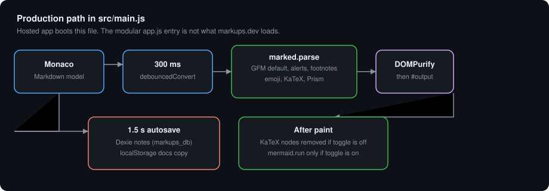
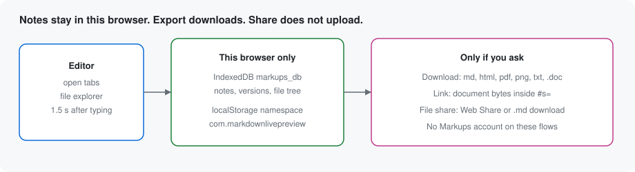
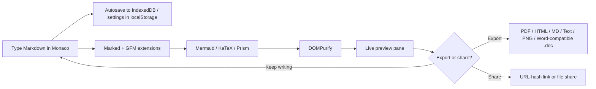

# Markups

**Free, browser-based Markdown editor with live preview** — powered by Monaco (the same editor engine as VS Code), with Mermaid diagrams, KaTeX math, and multi-format export.

- **Live app:** [https://markups.dev/](https://markups.dev/)
- **Source:** [https://github.com/Nir-Bhay/markups](https://github.com/Nir-Bhay/markups)

[](https://github.com/Nir-Bhay/markups/actions/workflows/ci.yml)
[](LICENSE)

## What it is

Markups is an online Markdown writing surface for people who want a serious editor in the browser without creating an account. Open the site, type Markdown, and watch a rendered preview update beside (or instead of) the source. Drafts are kept in the browser. Export and share are explicit actions you choose.

It is a good fit if you write READMEs, technical notes, math-heavy homework, or diagram-backed docs and want preview, PDF/HTML download, and GFM extras without installing a desktop app.

## Why it exists

Most “online Markdown editors” are either too thin to replace a daily driver, or they push you into accounts and hosted workspaces. Markups aims at the middle: Monaco for editing comfort, a real preview pipeline (GFM, Mermaid, KaTeX, code highlighting), and local-first drafts under an MIT license.

## What it is not

- Not a team wiki or real-time collaborative workspace (compare HackMD if you need that).
- Not a local vault/knowledge-base app (compare Obsidian if you need that).
- Not a paid desktop WYSIWYG product (compare Typora if you want that model).
- Not a full IDE — it is Markdown-focused, even though it uses the Monaco engine.

## Features (verified on the live app)

These are controls and behaviors present on [markups.dev](https://markups.dev/) today:

### Editor and view

- **Monaco editor** for Markdown source editing
- **View modes:** editor only, split, or preview only
- **Scroll sync** between editor and preview (toggle in the toolbar)
- **Editor themes** in Settings: VS Light, GitHub Light, Solarized Light, VS Dark, GitHub Dark, Dracula, Solarized Dark
- **Dark / light UI toggle**
- **Multi-tab documents** with a new-file control
- **File explorer** sidebar for open notes
- **Find / replace** and **version history** entry points in the header
- **Vim status** area (Vim mode support is wired in the app)
- **Focus mode**, **typewriter mode**, and **fullscreen**
- **Writing goals** and **document statistics** (words, characters, reading time, and related counts)
- **Templates** and **snippets**
- **Markdown lint** panel (“Check Markdown”)
- **Table of contents** sidebar / panel
- **Import** from file (and related import dialog options)

### Markdown rendering

- **GitHub Flavored Markdown** extras used in the preview pipeline (tables, task lists, strikethrough, alerts/callouts, footnotes, emoji shortcodes)
- **Mermaid** diagrams in fenced mermaid code blocks (toggle in Settings → Preview)
- **KaTeX** math with `$...$` / `$$...$$` (toggle in Settings → Preview)
- **Prism** syntax highlighting for fenced code blocks
- Preview HTML is passed through **DOMPurify** sanitization

### Export and share

Export modal formats available on the live app:

| Format | What you get |
|--------|----------------|
| Markdown | Download `.md` |
| PDF | Formatted PDF via client-side HTML → PDF |
| HTML | Standalone HTML download |
| DOCX | Word-compatible HTML saved as a `.doc` download (not a binary OOXML `.docx` package) |
| Text | Plain text |
| Image | PNG capture of the preview |
| Print | Browser print path |
| Copy MD / Copy HTML | Clipboard helpers |

Share is client-oriented: a **link that encodes the document in the URL hash**, and/or **file download / native file share**. There is no account gate on these flows.

### Installable app

A **web app manifest** and **service worker** are registered so browsers that support PWAs can install Markups and keep a cached shell for offline use after the first load.





## How editing becomes preview



## Honest comparison

Facts below are from each product’s public site or docs as checked while writing this README. Cells we could not verify are marked **not checked**. This is not a ranked scorecard.

| | Markups | StackEdit | Dillinger | HackMD | Obsidian | Typora | VS Code Markdown preview |
|---|---|---|---|---|---|---|---|
| **Price** | Free (MIT; no paywall on the live app) | Free (open-source web app) | Free (site states no paywall / no signup required) | Free plan + paid Prime / Enterprise ([pricing](https://hackmd.io/pricing)) | App free; optional Sync / Publish paid ([pricing](https://obsidian.md/pricing)) | One-time license **$14.99** before tax ([store](https://store.typora.io/)) | Free |
| **Account required to write** | No | No for basic editing; OAuth for Drive / Dropbox / GitHub sync | No; OAuth only if you connect cloud providers | Sign-up for the hosted product / team features | No for local vaults | No to run the app (license activates the paid product) | No |
| **Where files live** | Browser storage (localStorage + IndexedDB); exports are downloads | Browser; optional Google Drive, Dropbox, GitHub | Browser; optional GitHub, Dropbox, Google Drive, OneDrive, Bitbucket | HackMD-hosted notes | Local vault on disk | Local files on disk | Local workspace files |
| **Runs in the browser** | Yes | Yes | Yes | Yes | No (desktop / mobile apps) | No (desktop app) | No (desktop / Codespaces-style hosts) |
| **Offline** | PWA + service worker after first load | Site claims offline writing | Site claims offline editing after load | Hosted collaboration expects connectivity | Yes (local files) | Yes | Yes |
| **Open source** | Yes (this repo, MIT) | Yes ([benweet/stackedit](https://github.com/benweet/stackedit)) | Yes ([joemccann/dillinger](https://github.com/joemccann/dillinger)) | not checked for the commercial SaaS codebase | Source available for the app under its license terms; not “MIT SaaS” | Proprietary | [microsoft/vscode](https://github.com/microsoft/vscode) |

**Sources:** [markups.dev](https://markups.dev/), [Markups privacy policy](https://markups.dev/privacy-policy), [stackedit.io](https://stackedit.io/), [dillinger.io](https://dillinger.io/), [hackmd.io/pricing](https://hackmd.io/pricing), [obsidian.md](https://obsidian.md/) / [obsidian.md/pricing](https://obsidian.md/pricing), [store.typora.io](https://store.typora.io/), [VS Code Markdown docs](https://code.visualstudio.com/docs/languages/markdown).

## Runtime dependencies

What each production dependency does **in this app** (from `package.json` and the imports that use it):

| Package | Role here |
|---------|-----------|
| `monaco-editor` | The source editor UI and editing behaviors |
| `monaco-vim` | Vim keybindings overlay for Monaco |
| `marked` | Markdown → HTML parsing |
| `marked-gfm-heading-id` | Stable heading IDs for GFM-style anchors / TOC |
| `marked-highlight` | Hooks fenced code into Prism highlighting |
| `marked-alert` | GitHub-style alert / callout blocks |
| `marked-footnote` | Footnote syntax |
| `marked-emoji` | `:emoji:` shortcodes in preview |
| `marked-katex-extension` | Declared for KaTeX integration with Marked |
| `katex` | Renders math to HTML/MathML in the preview |
| `mermaid` | Renders diagram code fences in the preview |
| `prismjs` | Tokenizes code fences for highlighted HTML |
| `dompurify` | Sanitizes rendered HTML before it hits the DOM |
| `gemoji` | Emoji shortcode data used with marked-emoji |
| `github-markdown-css` | Preview styling familiar from GitHub README rendering |
| `html2pdf.js` | Client-side PDF generation path |
| `html2canvas` | Rasterizes preview content for PDF / image export |
| `dexie` | IndexedDB wrapper used for note / autosave persistence |

Dev-only tools (Vite, Vitest, Playwright, ESLint, and related test DOM shims) are listed under `devDependencies` and are not required to use the hosted app.

## FAQ

### What is Markups?
A free, MIT-licensed Markdown editor that runs at [markups.dev](https://markups.dev/). It uses Monaco for editing and renders a live preview with GFM, Mermaid, and KaTeX support.

### Is it free?
Yes. The live app does not present a paywall or subscription gate. The repository is MIT-licensed.

### Do I need an account?
No. There is no login requirement to open the editor and write.

### Where is my data stored?
Editor drafts and settings are stored in the browser (localStorage for settings/namespaced keys; IndexedDB via Dexie for notes/autosave). The [privacy policy](https://markups.dev/privacy-policy) states draft Markdown is not intentionally stored on Markups servers as part of normal editing. Public marketing pages may still use limited analytics.

### How does export work?
Export runs in the browser. PDF uses html2canvas / html2pdf against a prepared preview. HTML and Markdown download as files. The control labeled **DOCX** downloads Word-compatible HTML as a `.doc` file (not a zipped OOXML `.docx`). PNG captures the preview as an image. Copy actions write Markdown or HTML to the clipboard.

### How does share work?
Share can build a URL whose hash carries a compressed/encoded copy of the document, or hand you a markdown file via download / native share. Treat shared links like the document itself: anyone with the link can read the encoded content.

### Does it work offline?
After the first successful load, the registered service worker and web app manifest support install / offline shell behavior in browsers that implement PWAs. Always keep important work exported as files as well.

## Quick start (local development)

### Prerequisites

- **Node.js** 18 or newer (`engines.node` in `package.json`)

### Install and run

```bash
git clone https://github.com/Nir-Bhay/markups.git
cd markups
npm install
npm run dev
```

Then open the URL Vite prints (typically `http://localhost:5173`).

### Useful scripts

| Script | Purpose |
|--------|---------|
| `npm run dev` | Vite development server |
| `npm run build` | Production build into `dist/` |
| `npm run preview` | Preview the production build |
| `npm test` | Vitest unit tests |
| `npm run lint` | ESLint over `src/` |
| `npm run test:e2e` | Playwright end-to-end tests |

## Build and deploy

```bash
npm run build
npm run preview
```

The production site is configured for Vercel (`vercel.json`). Typical settings:

| Setting | Value |
|---------|-------|
| Framework | Vite |
| Build command | `npm run build` |
| Output directory | `dist` |

Other static hosts work the same way: serve the `dist/` folder after `npm run build`.

## Keyboard shortcuts

Defaults from the shortcuts manager (Ctrl on Windows/Linux, ⌘ on macOS):

| Action | Shortcut |
|--------|----------|
| Save | Ctrl/⌘ S |
| New document | Ctrl/⌘ N |
| Open / import | Ctrl/⌘ O |
| Bold | Ctrl/⌘ B |
| Italic | Ctrl/⌘ I |
| Insert link | Ctrl/⌘ K |
| Find | Ctrl/⌘ F |
| Find and replace | Ctrl/⌘ H |
| Toggle preview | Ctrl/⌘ \ |
| Toggle focus mode | Ctrl/⌘ Shift F |
| Toggle TOC | Ctrl/⌘ Shift T |
| Export (PDF shortcut binding) | Ctrl/⌘ Shift E |
| Cycle editor themes | Ctrl/⌘ D |
| Help | Ctrl/⌘ ? |

The Settings → Keyboard tab lists the full set available in the running app.

## Project structure

```
markups/
├── index.html              # App shell and UI chrome
├── package.json
├── vite.config.js
├── public/                 # Static assets, CSS, PWA pieces
├── docs/readme/            # README diagrams
└── src/
    ├── main.js             # Application entry
    ├── core/               # Editor, markdown pipeline, storage
    ├── features/           # Tabs, TOC, goals, templates, …
    ├── services/           # Export, share, autosave, PWA, shortcuts
    ├── ui/                 # Modals, theme UI, toasts
    └── utils/              # Shared helpers
```

## Contributing

Contributions are welcome.

1. Fork the repository
2. Create a feature branch (`git checkout -b feature/your-change`)
3. Commit your changes
4. Push the branch and open a Pull Request

Please keep PRs focused. Prefer verifying UI claims against the live app or a local `npm run dev` session before documenting new behavior.

## License

This project is licensed under the MIT License — see [LICENSE](LICENSE).

## Acknowledgments

- [Monaco Editor](https://microsoft.github.io/monaco-editor/) by Microsoft
- [Marked](https://marked.js.org/) for Markdown parsing
- [Mermaid](https://mermaid.js.org/) for diagrams
- [KaTeX](https://katex.org/) for math rendering
- [DOMPurify](https://github.com/cure53/DOMPurify) for HTML sanitization

---

Made by [Nir-Bhay](https://github.com/Nir-Bhay). Use the editor at [markups.dev](https://markups.dev/).
