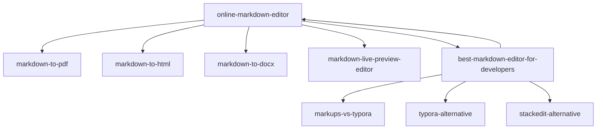

# Internal Linking Blueprint (Phase 4)

## Linking Model

Use a hub-and-spoke model:

- One pillar hub per cluster
- Support pages point to pillar
- Pillars cross-link to adjacent clusters

## Pillar Suggestions

| Cluster | Pillar URL | Supports |
|---------|------------|----------|
| BOFU Tools | `/seo/online-markdown-editor` | converter pages |
| Comparisons | `/seo/best-markdown-editor-for-developers` | vs/alternative pages |

## Mandatory Link Rules

1. Each support page links to:
   - its own cluster pillar
   - one adjacent support page
   - product action pages (`/` and `/landing`)
2. Each pillar links to:
   - all child pages in cluster
   - at least one page in adjacent cluster
3. Anchor text must describe intent, not generic text.

## Anchor Standards

- Good: `markdown to PDF editor`, `Typora alternative`, `live markdown preview`
- Avoid: `click here`, `learn more`

## Wave 1 Link Graph

## QA Check

- No orphan SEO pages
- At least 3 internal links per page
- Pillar pages have complete child coverage
