# Markups Deep Real-World & Edge-Case Markdown Corpus

> This is an **original compatibility corpus** for testing a Markdown editor/previewer.
>
> It intentionally mixes patterns commonly encountered in READMEs, technical docs, research writing, changelogs, product documentation, blogs, issue templates, and generated Markdown.

---

# 0. Test Matrix Header

| Layer | Examples | Expected focus |
|---|---|---|
| Core Markdown | headings, paragraphs, emphasis, links | parser correctness |
| GFM | tables, tasks, autolinks, footnotes, alerts | extension correctness |
| HTML | details, picture, table, kbd, mark | HTML handling |
| Math | inline, block, aligned, matrices | KaTeX/MathJax |
| Mermaid | many diagram families | diagram lifecycle |
| Code | 20+ languages, fences, indentation | syntax highlighting |
| Media | images, video, audio, iframe | browser + sanitization |
| Edge cases | malformed/ambiguous syntax | resilience |
| Layout | wide data, long URLs, deep nesting | CSS behavior |
| International | Unicode, RTL, CJK | text rendering |
| Metadata | YAML/TOML/JSON front matter | document parsing |

---

# 1. Blog / Article Front Matter

---
title: "How a Markdown Preview Engine Works"
description: "A realistic technical article used for renderer compatibility testing."
author: "Example Author"
date: 2026-09-15
tags:
  - markdown
  - rendering
  - testing
draft: false
---

## Introduction

A production Markdown renderer has to handle ordinary prose and the awkward cases that appear when users combine syntax without thinking about parser boundaries.

This paragraph intentionally contains **bold**, _italic_, ~~strikethrough~~, `inline code`, a [link](https://example.com), and Unicode: ₹ € ¥ 中文 हिंदी العربية 🚀.

---

# 2. Heading Stress

# H1

## H2

### H3

#### H4

##### H5

###### H6

## Duplicate Heading

Some content.

## Duplicate Heading

More content.

## Duplicate Heading

Even more content.

### Heading with punctuation: API v2.0 / C++ & TypeScript (β)

### Heading with `inline code`, **bold**, and _italic_

### This'll be a _Helpful_ Section About the Greek Letter Θ!

---

# 3. Paragraph and Line-Break Semantics

First line
Second line

First paragraph.

Second paragraph.

First hard break.  
Second line after two spaces.

First hard break.\
Second line after a backslash.

First hard break.<br>
Second line after HTML.

A paragraph with trailing punctuation!!!

A paragraph with a URL https://example.com/path?q=1&sort=desc#section

---

# 4. Emphasis Ambiguity

*italic*

_italic_

**bold**

__bold__

***bold italic***

___bold italic___

**bold _nested italic_**

*italic **nested bold***

***nested **bold** and _italic_***

~~strike~~

**~~bold strike~~**

~~**strike bold**~~

`**not bold**`

`*not italic*`

`` `code with backticks` ``

---

# 5. Escaping

\*literal asterisk\*

\_literal underscore\_

\# literal hash

\[literal bracket\]

\]literal bracket\]

\> literal greater-than

\- literal hyphen at paragraph start

\+ literal plus

\. literal period

\! literal exclamation

\\ literal backslash

\` literal backtick

\~ literal tilde

\| literal pipe

Escaped punctuation: ! # $ % & ' ( ) * + , - . / : ; < = > ? @ [ \ ] ^ _ ` { | } ~

---

# 6. Character Entities and Unicode

&amp; &lt; &gt; &quot; &apos;

&#35; &#x23;

&#x1F680; &#128640;

₹ ₹₹₹  ₹  $ € £ ¥ ₿

α β γ δ θ λ μ π σ φ Ω

👩‍💻 🧑🏽‍🚀 🏳️‍🌈 ❤️‍🔥 👍🏽

Zero-width-ish punctuation: foo⁠bar

Combining marks: é and é

---

# 7. Blockquotes

> Simple quote.

> Quote with **bold** and *italic*.
>
> Second paragraph in the quote.

> - List item
> - Another list item
>
> 1. Ordered item
> 2. Another item

> ```js
> const insideQuote = true;
> ```

> > Nested quote.
> >
> > > Third-level quote.

> [!NOTE]
> Alert inside quote-like syntax.

---

# 8. Lists: Deep and Mixed

- Item A
- Item B
  - B.1
  - B.2
    - B.2.a
    - B.2.b
      - B.2.b.i
- Item C

1. First
2. Second
   1. Nested ordered
   2. Another nested ordered
      1. Third level
      2. Another third level
3. Third

- Mixed
  1. Ordered child
  2. Another child
     - Unordered grandchild
     - Another grandchild

- Paragraph list item

  Second paragraph in the same list item.

  ```text
  Code belonging to the list item
  ```

  > Quote belonging to the list item.

---

# 9. Task Lists

- [x] Completed task
- [ ] Open task
- [X] Uppercase X
- [ ] Task containing **bold**
- [ ] Task containing `code`
- [ ] Task containing a [link](https://example.com)
- [ ] \(Escaped parenthesis) task
- [ ] Task with emoji 🚀

- [ ] Parent
  - [x] Nested complete
  - [ ] Nested open

---

# 10. Tables

| Feature | Supported | Notes | Example |
| :--- | :---: | ---: | :--- |
| Markdown | ✅ | Core | `# heading` |
| GFM | ✅ | Extension | tables |
| Mermaid | ✅ | Diagram | `flowchart TD` |
| Math | ✅ | Equation | $x^2$ |

## Wide Table

| ID | Name | Description | URL | Status | Notes |
|---|---|---|---|---|---|
| 001 | alpha | A deliberately long description that should wrap cleanly without causing the entire page to overflow horizontally. | https://example.com/really/long/path/for/testing/wrapping?foo=bar&hello=world | Active | Test wrapping |
| 002 | beta | Contains **bold**, _italic_, `code`, and a [link](https://example.com). | https://example.org | Pending | Another row |
| 003 | gamma | Math: $\sum_{i=1}^{n} i$ | https://example.net | Done | Equation |

## Pipes Inside Cells

| Expression | Value |
|---|---|
| `a \| b` | Escaped pipe |
| a &#124; b | HTML entity pipe |
| normal text | normal |

---

# 11. Links: Weird but Valid-Looking

[Normal link](https://example.com)

[Link with title](https://example.com "Example title")

[Link with punctuation](https://example.com/a(b)c)

[Link with query](https://example.com/search?q=hello%20world&sort=desc)

[Link with fragment](https://example.com/docs#installation)

[Email](mailto:developer@example.com)

<https://example.com>

<https://example.com/a/b?q=1>

<developer@example.com>

Reference link [Example][ref-one]

Collapsed reference [Example][]

[ref-one]: https://example.com/reference "Reference title"

[Example]: https://example.org/

---

# 12. Autolinks and URL-like Text

https://example.com

http://example.com

www.example.com

ftp://example.com

user@example.com

https://example.com/path_(with_parentheses)

https://example.com/path%20with%20spaces

https://example.com/?emoji=%F0%9F%9A%80

---

# 13. Images and Image Captions


[](https://example.com)

HTML image:


---

# 14. Picture / Responsive Image

<picture>
  <source media="(prefers-color-scheme: dark)" srcset="https://images.unsplash.com/photo-1518770660439-4636190af475?w=1200">
  <source media="(max-width: 600px)" srcset="https://images.unsplash.com/photo-1555066931-4365d14bab8c?w=600">
  
</picture>

---

# 15. Code: Fence Variants

```text
plain text
```

~~~text
tilde fence
~~~

````markdown
```js
console.log("nested fence");
```
````

```javascript
const a = 1;
const b = 2;
console.log(a + b);
```

```typescript
type User = {
  id: string;
  name?: string;
};
```

```tsx
export function Button() {
  return <button type="button">Save</button>;
}
```

```python
from pathlib import Path

files = list(Path(".").glob("**/*.md"))
print(f"Markdown files: {len(files)}")
```

```rust
fn main() {
    let values = vec![1, 2, 3, 4];
    let total: i32 = values.iter().sum();
    println!("{total}");
}
```

```go
package main

import "fmt"

func main() {
    fmt.Println("Hello")
}
```

```sql
SELECT
  u.id,
  u.email,
  COUNT(d.id) AS documents
FROM users u
LEFT JOIN documents d ON d.user_id = u.id
GROUP BY u.id, u.email;
```

```bash
#!/usr/bin/env bash
set -euo pipefail

echo "build"
npm ci
npm run build
```

```yaml
services:
  app:
    image: example/app:latest
    environment:
      NODE_ENV: production
```

```json
{
  "name": "markups",
  "private": true,
  "scripts": {
    "dev": "vite",
    "build": "vite build"
  }
}
```

```html
<main class="content">
  <h1>Hello</h1>
</main>
```

```css
.content {
  max-width: 72rem;
  margin-inline: auto;
  padding: 1.5rem;
}
```

```diff
- const oldValue = true;
+ const newValue = false;
```

```dockerfile
FROM node:22-alpine
WORKDIR /app
COPY package*.json ./
RUN npm ci
COPY . .
CMD ["npm", "run", "start"]
```

```graphql
query Projects {
  projects {
    id
    name
  }
}
```

```regex
^(?:https?|ftp):\/\/[^\s/$.?#].[^\s]*$
```

```text
An intentionally very long line inside a code block ....................................................................................................................................................................................
```

---

# 16. Indented Code Blocks

    const indented = true;
    console.log(indented);

Paragraph after indented code.

---

# 17. HTML Table Inside Markdown

<table>
  <thead>
    <tr>
      <th>Feature</th>
      <th>Status</th>
    </tr>
  </thead>
  <tbody>
    <tr>
      <td>Markdown</td>
      <td>Ready</td>
    </tr>
    <tr>
      <td>Mermaid</td>
      <td>Ready</td>
    </tr>
  </tbody>
</table>

---

# 18. Details / Summary Combinations

<details>
<summary>Closed section</summary>

Hidden content.

```js
const hidden = "content";
```

</details>

<details open>
<summary>Initially open</summary>

This one begins open.

| Key | Value |
|---|---|
| mode | open |

</details>

<details>
<summary>Mermaid inside details</summary>

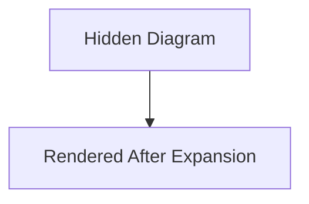
```mermaid
flowchart TD
    A[Hidden Diagram] --> B[Rendered After Expansion]
```

</details>

<details>
<summary>Math inside details</summary>

$$
E = mc^2
$$

</details>

---

# 19. Keyboard / Mark / Sub / Sup

Press <kbd>Ctrl</kbd> + <kbd>K</kbd>.

Use <mark>highlighted</mark> text.

Water is H<sub>2</sub>O.

The equation is x<sup>2</sup> + y<sup>2</sup>.

This is <ins>inserted</ins> and this is <del>removed</del>.

---

# 20. HTML Comment

<!--
This section should not be visible in the rendered document.
It contains **Markdown** that should remain hidden.
-->

Visible text after the comment.

---

# 21. Footnotes: Rich Content

Here is a reference.[^a]

Here is another reference.[^b]

Repeated reference.[^a]

[^a]: A simple footnote.

[^b]:
    A multiline footnote with **bold** text,
    a [link](https://example.com), and a code span `x = 1`.

---

# 22. Alerts / Callouts

> [!NOTE]
> Useful information for the reader.

> [!TIP]
> A helpful recommendation.

> [!IMPORTANT]
> Information that should not be missed.

> [!WARNING]
> Something that may require attention.

> [!CAUTION]
> A potentially destructive operation.

Mixed content:

> [!NOTE]
> This alert has **bold**, _italic_, `code`, a [link](https://example.com), and a list:
>
> - one
> - two

---

# 23. Math: Inline

Einstein: $E = mc^2$.

Quadratic: $x = \frac{-b \pm \sqrt{b^2 - 4ac}}{2a}$.

Probability: $P(A \mid B)$.

Set notation: $x \in \mathbb{R}$.

Inline expression with Markdown-like characters: $a_1 + a_2 + \cdots + a_n$.

---

# 24. Math: Blocks

$$
\int_0^1 x^2\,dx = \frac{1}{3}
$$

$$
\sum_{i=1}^{n} i = \frac{n(n+1)}{2}
$$

$$
\lim_{x \to 0} \frac{\sin x}{x} = 1
$$

$$
\begin{bmatrix}
1 & 2 & 3 \\
4 & 5 & 6 \\
7 & 8 & 9
\end{bmatrix}
$$

$$
f(x)=
\begin{cases}
x^2 & x \ge 0 \\
-x & x < 0
\end{cases}
$$

$$
\begin{aligned}
a &= b + c \\
  &= d + e
\end{aligned}
$$

---

# 25. Math Delimiter Edge Cases

Text with a dollar sign: $100.

Escaped dollar: \\$100.

Inline: $x$.

Inline with punctuation: $x^2$.

Inline with adjacent text: before $x$ after.

GitHub-style backtick math probe: $`x^2 + y^2 = z^2`$

Block:

$$
x^2 + y^2 = z^2
$$

---

# 26. Mermaid: Flowchart

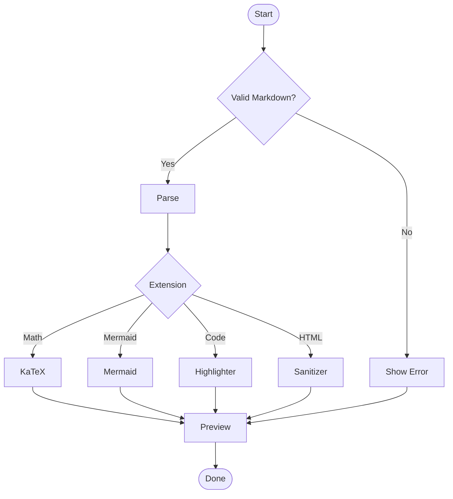
```mermaid
flowchart TD
    A([Start]) --> B{Valid Markdown?}
    B -->|Yes| C[Parse]
    B -->|No| D[Show Error]
    C --> E{Extension}
    E -->|Math| F[KaTeX]
    E -->|Mermaid| G[Mermaid]
    E -->|Code| H[Highlighter]
    E -->|HTML| I[Sanitizer]
    F --> J[Preview]
    G --> J
    H --> J
    I --> J
    D --> J
    J --> K([Done])
```

---

# 27. Mermaid: State

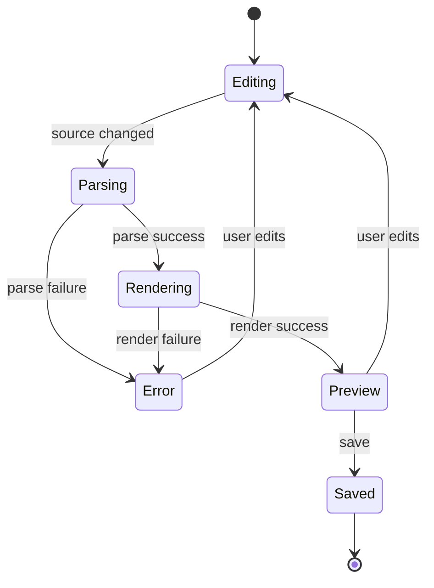
```mermaid
stateDiagram-v2
    [*] --> Editing
    Editing --> Parsing: source changed
    Parsing --> Rendering: parse success
    Parsing --> Error: parse failure
    Rendering --> Preview: render success
    Rendering --> Error: render failure
    Error --> Editing: user edits
    Preview --> Editing: user edits
    Preview --> Saved: save
    Saved --> [*]
```

---

# 28. Mermaid: Sequence

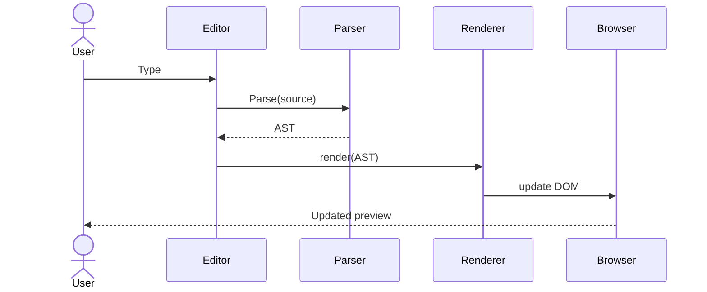
```mermaid
sequenceDiagram
    actor User
    participant Editor
    participant Parser
    participant Renderer
    participant Browser

    User->>Editor: Type
    Editor->>Parser: Parse(source)
    Parser-->>Editor: AST
    Editor->>Renderer: render(AST)
    Renderer->>Browser: update DOM
    Browser-->>User: Updated preview
```

---

# 29. Mermaid: Class

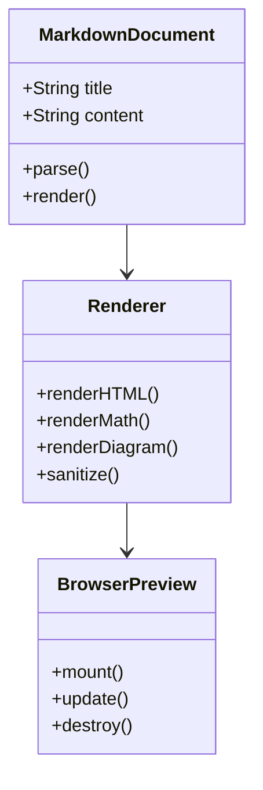
```mermaid
classDiagram
    class MarkdownDocument {
        +String title
        +String content
        +parse()
        +render()
    }

    class Renderer {
        +renderHTML()
        +renderMath()
        +renderDiagram()
        +sanitize()
    }

    class BrowserPreview {
        +mount()
        +update()
        +destroy()
    }

    MarkdownDocument --> Renderer
    Renderer --> BrowserPreview
```

---

# 30. Mermaid: ER

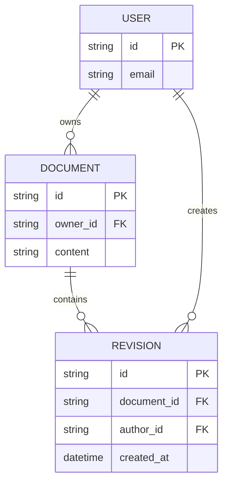
```mermaid
erDiagram
    USER ||--o{ DOCUMENT : owns
    DOCUMENT ||--o{ REVISION : contains
    USER ||--o{ REVISION : creates

    USER {
        string id PK
        string email
    }

    DOCUMENT {
        string id PK
        string owner_id FK
        string content
    }

    REVISION {
        string id PK
        string document_id FK
        string author_id FK
        datetime created_at
    }
```

---

# 31. Mermaid: Gantt

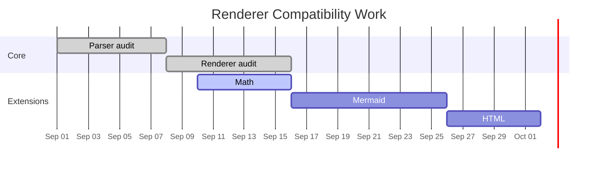
```mermaid
gantt
    title Renderer Compatibility Work
    dateFormat YYYY-MM-DD
    axisFormat %b %d

    section Core
    Parser audit :done, core1, 2026-09-01, 7d
    Renderer audit :done, core2, after core1, 8d

    section Extensions
    Math :active, ext1, 2026-09-10, 6d
    Mermaid :ext2, after ext1, 10d
    HTML :ext3, after ext2, 6d
```

---

# 32. Mermaid: Pie

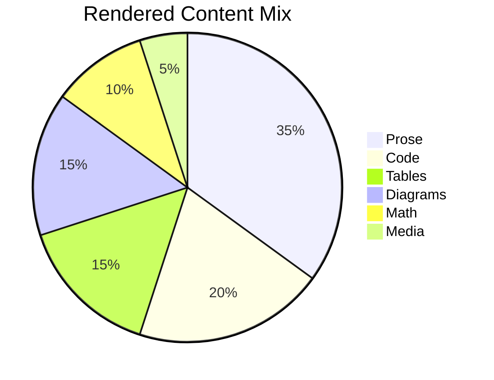
```mermaid
pie title Rendered Content Mix
    "Prose" : 35
    "Code" : 20
    "Tables" : 15
    "Diagrams" : 15
    "Math" : 10
    "Media" : 5
```

---

# 33. Mermaid: Git Graph

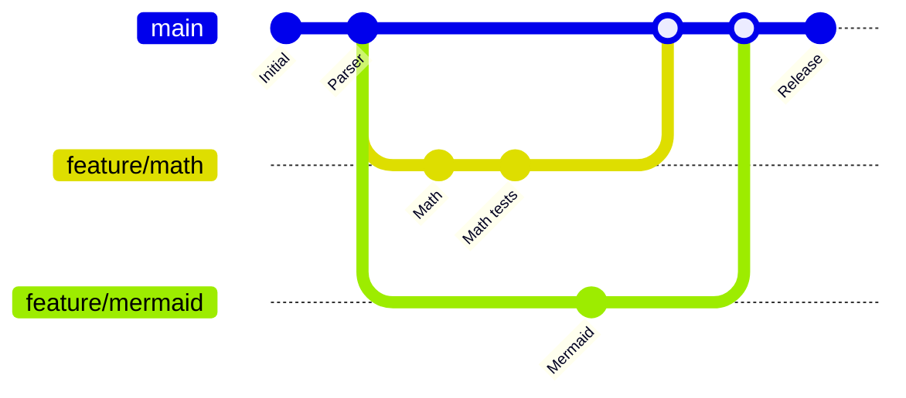
```mermaid
gitGraph
    commit id: "Initial"
    commit id: "Parser"
    branch feature/math
    checkout feature/math
    commit id: "Math"
    commit id: "Math tests"
    checkout main
    branch feature/mermaid
    commit id: "Mermaid"
    checkout main
    merge feature/math
    merge feature/mermaid
    commit id: "Release"
```

---

# 34. Mermaid: User Journey

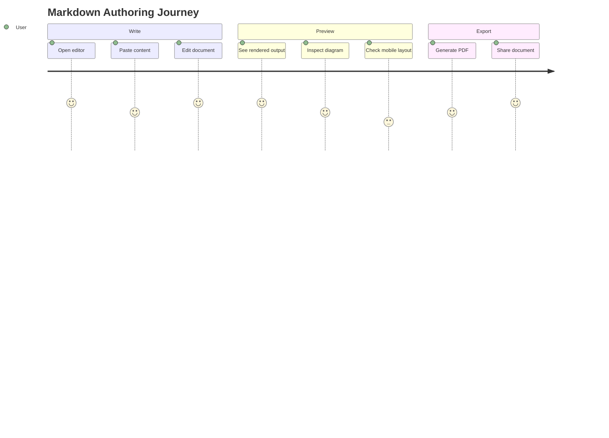
```mermaid
journey
    title Markdown Authoring Journey
    section Write
      Open editor: 5: User
      Paste content: 4: User
      Edit document: 5: User
    section Preview
      See rendered output: 5: User
      Inspect diagram: 4: User
      Check mobile layout: 3: User
    section Export
      Generate PDF: 4: User
      Share document: 5: User
```

---

# 35. Mermaid: Mindmap

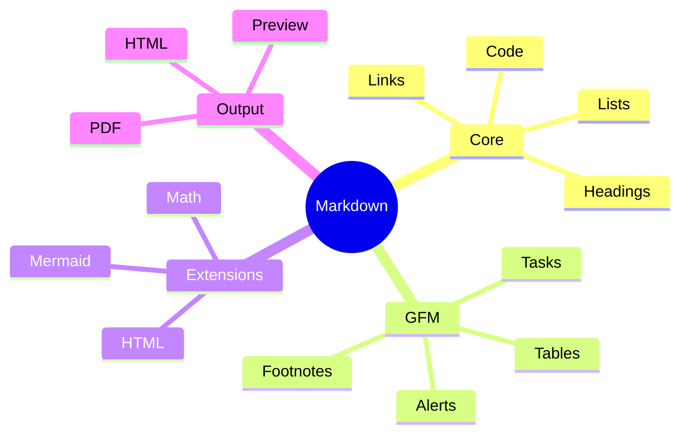
```mermaid
mindmap
  root((Markdown))
    Core
      Headings
      Lists
      Links
      Code
    GFM
      Tables
      Tasks
      Footnotes
      Alerts
    Extensions
      Math
      Mermaid
      HTML
    Output
      Preview
      PDF
      HTML
```

---

# 36. Mermaid: Timeline

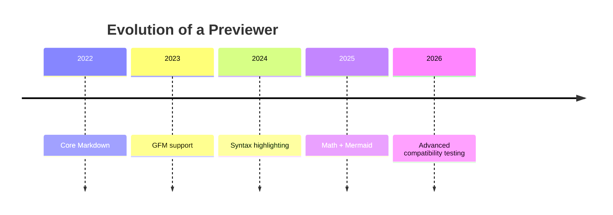
```mermaid
timeline
    title Evolution of a Previewer
    2022 : Core Markdown
    2023 : GFM support
    2024 : Syntax highlighting
    2025 : Math + Mermaid
    2026 : Advanced compatibility testing
```

---

# 37. Mermaid: Architecture

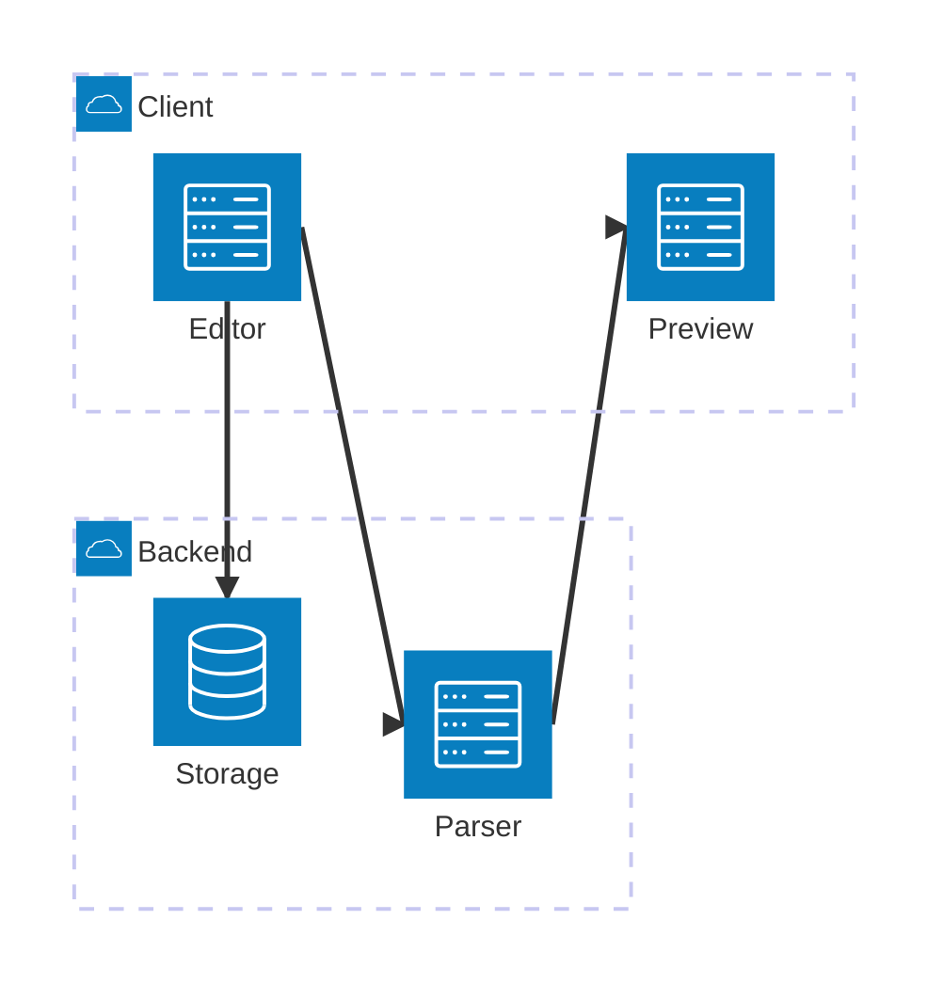
```mermaid
architecture-beta
    group client(cloud)[Client]
    service editor(server)[Editor] in client
    service preview(server)[Preview] in client

    group backend(cloud)[Backend]
    service parser(server)[Parser] in backend
    service storage(database)[Storage] in backend

    editor:R --> L:parser
    parser:R --> L:preview
    editor:B --> T:storage
```

---

# 38. Mermaid: Block

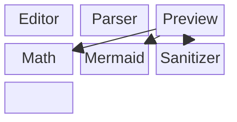
```mermaid
block-beta
    columns 3
    A["Editor"] B["Parser"] C["Preview"]
    D["Math"] E["Mermaid"] F["Sanitizer"]
    A --> B --> C
    C --> D
    C --> E
    C --> F
```

---

# 39. Mermaid: Quadrant

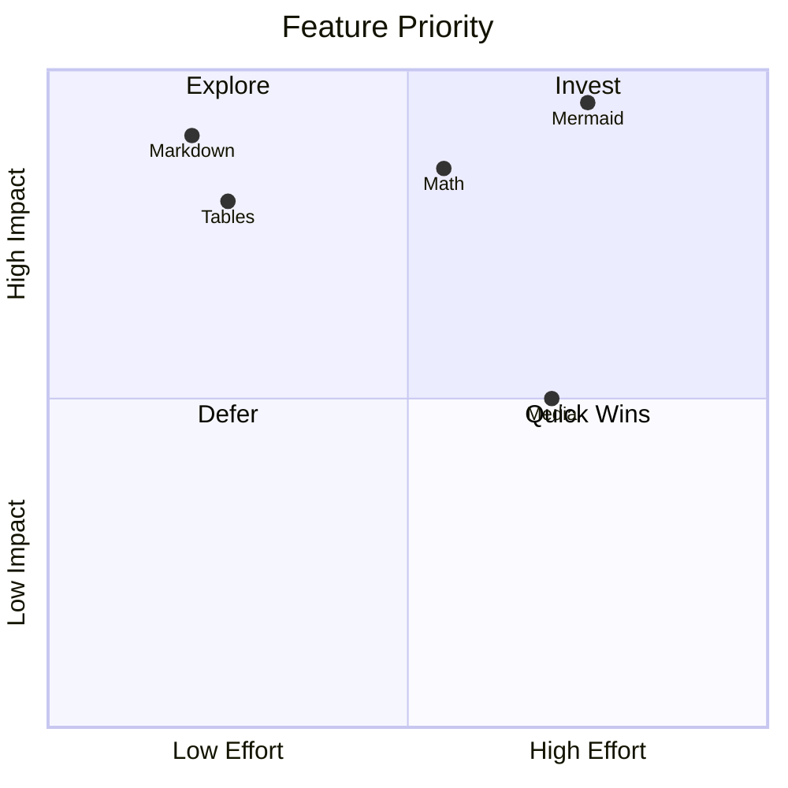
```mermaid
quadrantChart
    title Feature Priority
    x-axis Low Effort --> High Effort
    y-axis Low Impact --> High Impact
    quadrant-1 Invest
    quadrant-2 Explore
    quadrant-3 Defer
    quadrant-4 Quick Wins
    Markdown: [0.2, 0.9]
    Tables: [0.25, 0.8]
    Math: [0.55, 0.85]
    Mermaid: [0.75, 0.95]
    Media: [0.7, 0.5]
```

---

# 40. Mermaid: XY Chart

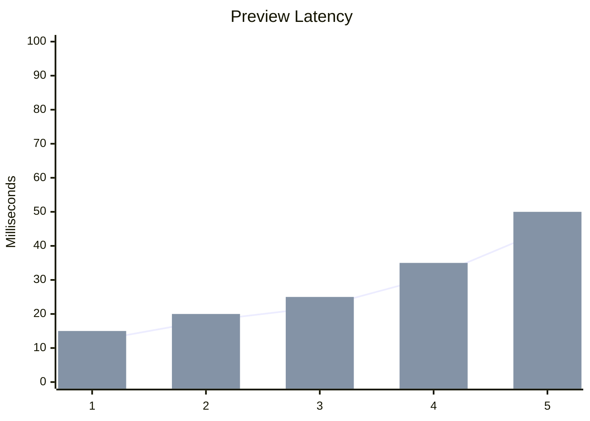
```mermaid
xychart-beta
    title "Preview Latency"
    x-axis [1, 2, 3, 4, 5]
    y-axis "Milliseconds" 0 --> 100
    line [12, 18, 22, 31, 45]
    bar [15, 20, 25, 35, 50]
```

---

# 41. Mermaid: Sankey

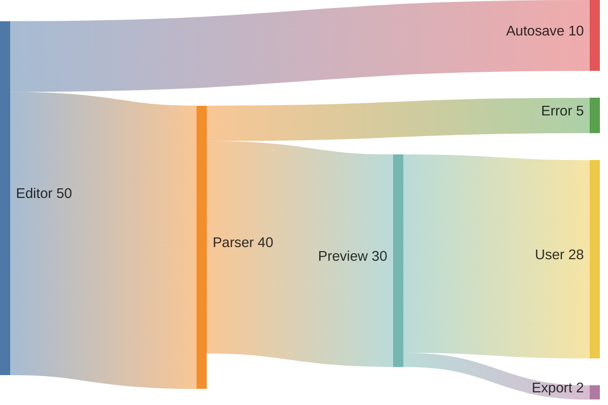
```mermaid
sankey-beta
Editor,Parser,40
Editor,Autosave,10
Parser,Preview,30
Parser,Error,5
Preview,User,28
Preview,Export,2
```

---

# 42. Mermaid: Radar

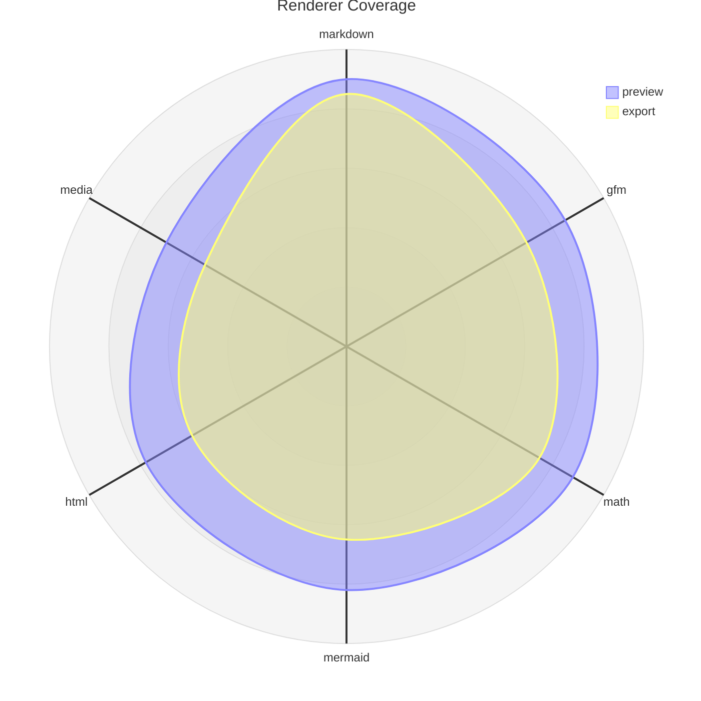
```mermaid
radar-beta
    title Renderer Coverage
    axis markdown, gfm, math, mermaid, html, media
    curve preview{90, 85, 88, 82, 78, 70}
    curve export{85, 70, 75, 65, 60, 55}
    max 100
    min 0
```

---

# 43. Mermaid: Venn

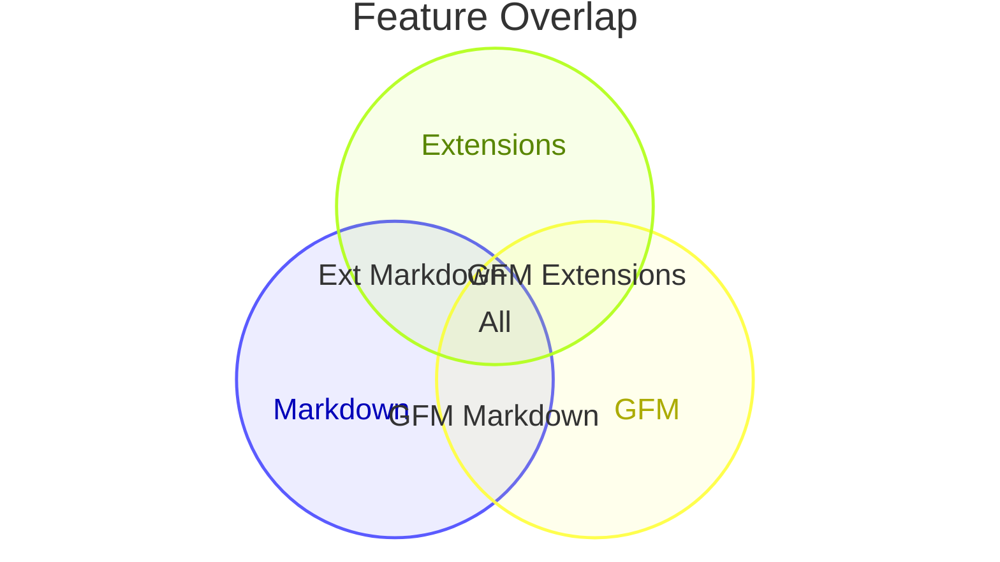
```mermaid
venn-beta
    title Feature Overlap
    set Markdown["Markdown"]
    set GFM["GFM"]
    set Extensions["Extensions"]
    union Markdown,GFM["GFM Markdown"]
    union GFM,Extensions["GFM Extensions"]
    union Markdown,Extensions["Ext Markdown"]
    union Markdown,GFM,Extensions["All"]
```

---

# 44. Mermaid: Invalid / Error Handling Probe

```mermaid
this is intentionally not valid mermaid syntax
```

The renderer should fail gracefully, not crash the complete document.

---

# 45. Raw HTML

<div>
  <strong>Strong HTML content</strong>
  <em>Emphasized HTML content</em>
</div>

<span title="tooltip">Hover target</span>

<p align="center">Centered paragraph through HTML.</p>

<hr>

<br>

---

# 46. Unsafe HTML / Sanitization Probe

<!-- These examples are intentionally unsafe-looking.
     They must not execute JavaScript. -->

<script>
  window.__MARKUPS_SECURITY_TEST__ = "executed";
</script>


<a href="javascript:alert('xss')">Unsafe protocol test</a>

<div onclick="alert('xss')">Unsafe event attribute test</div>

The preview should remain stable and safe.

---

# 47. Iframe / Embed Probe

<iframe
  title="Example"
  width="560"
  height="315"
  src="https://example.com">
</iframe>

The important result is graceful handling according to the application's sanitization policy.

---

# 48. Video / Audio

<video controls width="640">
  <source src="https://interactive-examples.mdn.mozilla.net/media/cc0-videos/flower.mp4" type="video/mp4">
</video>

<audio controls>
  <source src="https://interactive-examples.mdn.mozilla.net/media/cc0-audio/t-rex-roar.mp3" type="audio/mpeg">
</audio>

---

# 49. Horizontal Overflow Test

AAAAAAAAAAAAAAAAAAAAAAAAAAAAAAAAAAAAAAAAAAAAAAAAAAAAAAAAAAAAAAAAAAAAAAAAAAAAAAAAAAAAAAAAAAAAAAAAAAAAAAAAAAAAAAAAAAAAAAAAAAAAAAAAAAAAAAAAAAAAAAAAAAAAAAAAAAAAAAAAAAAAAAAAAAAAAAAAAAAA

https://example.com/aaaaaaaaaaaaaaaaaaaaaaaaaaaaaaaaaaaaaaaaaaaaaaaaaaaaaaaaaaaaaaaaaaaaaaaaaaaaaaaaaaaaaaaaaaaaaaaaaaaaaaaaaaaaaaaaaaaaaaaaaaaaaaaaaaaaaaaaaaaaaaaaaaaaaaaaaaaa?parameter=bbbbbbbbbbbbbbbbbbbbbbbbbbbbbbbbbbbbbbbbbbbbbbbbbbbbbbbbbbbbbbbbbbbbbbbbbbbbbbbbbbbbbbbb

| Column A | Column B | Column C | Column D |
|---|---|---|---|
| ExtremelyLongUnbrokenWordThatShouldNotForceTheEntirePageToOverflowOnMobile | MoreLongText | 1234567890123456789012345678901234567890 | End |

---

# 50. Whitespace

Leading spaces are intentionally included below:

   indented-looking text

Multiple    internal    spaces.

Trailing spaces should not create unexpected layout artifacts.  

Empty lines:


Text after multiple blank lines.

---

# 51. Backticks and Fence Collisions

```
text containing ``` three backticks
```

````text
text containing ```
and nested fences
```
````

~~~markdown
```javascript
console.log("nested");
```
~~~

---

# 52. Markdown Inside Code Must Stay Code

````markdown
# This must remain a literal H1

**This is not bold**

[This is not a link](https://example.com)

```mermaid
flowchart TD
A --> B
```
````

---

# 53. Markdown Adjacent to HTML

<div>

## Is this heading parsed?

**Bold inside HTML block**

</div>

Paragraph after the HTML block.

---

# 54. Link Definition Placement

A reference can be defined far away from where it is used.

[Far Away Reference][remote]

Some unrelated content.

More unrelated content.

[remote]: https://example.com/far-away

---

# 55. Duplicate Reference Definitions

[One][dup]

[Two][dup]

[dup]: https://example.com/first

[dup]: https://example.com/second

---

# 56. Duplicate Heading Anchors

## Repeated

First.

## Repeated

Second.

## Repeated

Third.

Internal links:

- [First repeated section](#repeated)
- [Second repeated section](#repeated-1)
- [Third repeated section](#repeated-2)

---

# 57. Escaped and Literal Markdown

This should display literal characters:

\*\*not bold\*\*

\_\_not bold\_\_

\# not a heading

\[not a link\]

> This blockquote is real.

\> This should be literal greater-than.

---

# 58. Comments Around Markdown

Before comment.

<!-- hidden comment -->

After comment.

<!--
# Hidden heading

This should not appear.
-->

---

# 59. Changelog Style

# Changelog

## [2.4.0] - 2026-09-15

### Added

- Mermaid architecture diagrams.
- Math rendering.
- Responsive table handling.

### Changed

- Improved preview scheduling.
- Reduced redundant rendering.

### Fixed

- Duplicate diagram rendering.
- Long code block overflow.
- Broken anchor navigation.

### Deprecated

- Legacy renderer API.

### Security

> [!CAUTION]
> Never render untrusted HTML without sanitization.

---

# 60. Release Notes With Links

## v2.4.0

This release improves the **Markdown preview pipeline**.

Highlights:

1. Faster previews.
2. Better Mermaid lifecycle handling.
3. Improved mathematical notation.
4. Better mobile behavior.

Compare with [v2.3.0](https://example.com/releases/v2.3.0).

---

# 61. API Documentation With Nested Structures

## `POST /api/documents`

Request body:

```json
{
  "title": "Example",
  "content": "# Hello",
  "options": {
    "preview": {
      "math": true,
      "mermaid": true
    }
  }
}
```

### Response

```json
{
  "id": "doc_01",
  "status": "created",
  "links": {
    "self": "/api/documents/doc_01"
  }
}
```

---

# 62. Research Table

| Model | Parameters | Dataset | Accuracy | Latency | Notes |
|---|---:|---|---:|---:|---|
| A | 7B | Dataset-1 | 91.2% | 120ms | baseline |
| B | 13B | Dataset-2 | 93.8% | 180ms | larger |
| C | 34B | Dataset-2 | 95.1% | 340ms | best accuracy |
| D | 70B | Dataset-3 | 96.0% | 620ms | expensive |

---

# 63. Research Equations

For a model with parameters $\theta$ and dataset $D$:

$$
\hat{\theta}
=
\arg\min_{\theta}
\frac{1}{|D|}
\sum_{(x,y)\in D}
\mathcal{L}(f_\theta(x),y)
$$

Bayes:

$$
P(\theta \mid D)
\propto
P(D \mid \theta)P(\theta)
$$

Attention:

$$
\operatorname{Attention}(Q,K,V)
=
\operatorname{softmax}
\left(
\frac{QK^T}{\sqrt{d_k}}
\right)V
$$

---

# 64. Mermaid + Math + Table Interaction

The pipeline computes a score:

$$
S = w_m M + w_g G + w_v V
$$

```mermaid
flowchart LR
    M[Math] --> S[Score]
    G[GFM] --> S
    V[Visual] --> S
```

| Component | Formula | Diagram |
|---|---|---|
| Math | $x^2$ | Mermaid |
| GFM | **bold** | Table |
| Visual | image | HTML |

---

# 65. Long Narrative

A realistic documentation page can contain a title, a table of contents, explanatory paragraphs, screenshots, code samples, API request examples, warnings, notes, collapsible implementation details, mathematical notation, Mermaid architecture diagrams, benchmark tables, links to related documents, and a changelog. The renderer should preserve the semantic hierarchy of that entire document without producing surprising whitespace, duplicated nodes, inaccessible controls, broken links, clipped equations, or diagrams that escape their containers.

This paragraph is intentionally long enough to test ordinary line wrapping while still containing Markdown syntax such as **strong emphasis**, _emphasis_, `code`, [a link](https://example.com), and the Unicode symbols ✓ → ≈ ∑.

---

# 66. International Documentation

## हिन्दी

यह अनुभाग Markdown renderer में Unicode, देवनागरी, शब्द wrapping और line-height को test करने के लिए है। इसमें **bold**, _italic_ और `inline code` भी शामिल हैं।

## العربية

هذا القسم يختبر اتجاه النص من اليمين إلى اليسار، والمسافات، وتنسيق Markdown داخل اللغة العربية.

## 日本語

このセクションでは、日本語の文字、行の折り返し、Markdown の装飾、およびコード表示を確認します。

## 한국어

이 섹션은 한국어 텍스트와 줄바꿈을 테스트합니다.

---

# 67. RTL Mixed Content

English before العربية and بعد العربية English after.

`code` العربية **bold العربية** [link العربية](https://example.com)

---

# 68. Emoji and Symbols

:rocket: 🚀 :fire: 🔥 :white_check_mark: ✅ :warning: ⚠️

ASCII symbols:

`< > <= >= != == => -> <- :: && ||`

---

# 69. Definition-like Documentation

### Parse

**Parse** means converting source Markdown into a structured representation.

### Render

**Render** means converting that representation into visible output.

### Sanitize

**Sanitize** means removing or neutralizing unsafe constructs before inserting content into the DOM.

---

# 70. Final Integrated Document

> [!IMPORTANT]
> Everything below intentionally combines multiple real-world patterns.

## Preview Engine Overview

Markups transforms:

$$
source \\rightarrow parse \\rightarrow transform \\rightarrow sanitize \\rightarrow render
$$

```mermaid
flowchart LR
    A[Source] --> B[Parser]
    B --> C[Transform]
    C --> D[Sanitize]
    D --> E[Renderer]
    E --> F[Browser]
```

### Example Configuration

```yaml
preview:
  markdown: true
  gfm: true
  math: true
  mermaid: true
  html: true
  sanitize: true
```

### Compatibility

| Feature | Core | GFM | Extension | Browser |
|---|:---:|:---:|:---:|:---:|
| Headings | ✅ | ✅ | — | ✅ |
| Tables | — | ✅ | — | ✅ |
| Math | — | — | ✅ | ✅ |
| Mermaid | — | — | ✅ | ✅ |
| Raw HTML | partial | partial | — | ✅ |
| Video | — | — | HTML | browser-dependent |

### Final checklist

- [x] Basic syntax
- [x] GFM patterns
- [x] Code
- [x] Math
- [x] Mermaid
- [x] Tables
- [x] Images
- [x] Media
- [x] HTML
- [x] Unicode
- [ ] Export comparison

---

# 71. Malformed Syntax Regression Zone

This final zone intentionally contains malformed or ambiguous structures. The previewer must remain stable.

**Unclosed bold

_ unclosed italic

[Broken link](

![Broken image](

```js
const unclosed = true;

> Unbalanced structures should not crash the application.

| broken | table
| --- |

```mermaid
flowchart TD
A -->
```

$$
\frac{1}{2}

<details>
<summary>Unclosed details

Visible fallback text.

<!-- unclosed comment

---

# 72. End-to-End Acceptance

The document passes the real-world renderer audit only when:

- valid constructs render correctly;
- unsupported constructs fail gracefully;
- malformed constructs do not crash the application;
- external resources fail without taking down the page;
- long content does not cause unexpected page-level overflow;
- diagrams and equations render exactly once;
- editor changes do not leave stale preview artifacts;
- theme changes do not make content unreadable;
- mobile layouts remain usable;
- unsafe HTML does not execute;
- navigation anchors behave predictably;
- code blocks remain copyable/readable;
- the document remains stable after repeated edits.

---

# END OF DEEP REAL-WORLD MARKDOWN CORPUS
