# Markups Markdown Preview Stress Test

> **Purpose:** Paste this entire file into **Markups** and inspect the rendered preview section by section.
>
> This file intentionally mixes standard Markdown, GitHub Flavored Markdown-style extensions, Mermaid, LaTeX/math, raw HTML, media, syntax highlighting, tables, edge cases, and research-document patterns.

**Build target:** Markdown previewer / live renderer  
**Test profile:** 🧪 parser + renderer + layout + interaction + accessibility + media loading

---

## Table of Contents

1. [Typography](#typography)
2. [Headings](#headings)
3. [Paragraphs and line breaks](#paragraphs-and-line-breaks)
4. [Emphasis](#emphasis)
5. [Inline code and escaping](#inline-code-and-escaping)
6. [Links](#links)
7. [Images](#images)
8. [Blockquotes](#blockquotes)
9. [Lists](#lists)
10. [Task lists](#task-lists)
11. [Tables](#tables)
12. [GitHub-style alerts](#github-style-alerts)
13. [Collapsible sections](#collapsible-sections)
14. [Footnotes](#footnotes)
15. [Code blocks](#code-blocks)
16. [Diffs](#diffs)
17. [Math](#math)
18. [Mermaid flowcharts](#mermaid-flowcharts)
19. [Mermaid sequence diagram](#mermaid-sequence-diagram)
20. [Mermaid class diagram](#mermaid-class-diagram)
21. [Mermaid state diagram](#mermaid-state-diagram)
22. [Mermaid ER diagram](#mermaid-er-diagram)
23. [Mermaid Gantt](#mermaid-gantt)
24. [Mermaid pie](#mermaid-pie)
25. [Mermaid journey](#mermaid-journey)
26. [Mermaid mindmap](#mermaid-mindmap)
27. [Mermaid timeline](#mermaid-timeline)
28. [Mermaid XY chart](#mermaid-xy-chart)
29. [Mermaid quadrant](#mermaid-quadrant)
30. [Mermaid architecture](#mermaid-architecture)
31. [Mermaid git graph](#mermaid-git-graph)
32. [Mermaid requirement diagram](#mermaid-requirement-diagram)
33. [Raw HTML](#raw-html)
34. [Media](#media)
35. [Color and visual styling probes](#color-and-visual-styling-probes)
36. [Research-paper style content](#research-paper-style-content)
37. [README-style product content](#readme-style-product-content)
38. [Real-world technical documentation](#real-world-technical-documentation)
39. [JSON/YAML/XML/SQL/Shell fixtures](#jsonyamlxmlsqlshell-fixtures)
40. [Edge cases and parser traps](#edge-cases-and-parser-traps)
41. [Accessibility probes](#accessibility-probes)
42. [Rendering QA checklist](#rendering-qa-checklist)

---

# Typography

## Headings

# Heading level 1
## Heading level 2
### Heading level 3
#### Heading level 4
##### Heading level 5
###### Heading level 6

Setext-style level 1
=====================

Setext-style level 2
---------------------

## Paragraphs and line breaks

This is a normal paragraph with **bold**, *italic*, ***bold italic***, ~~strikethrough~~, and `inline code`.

Two spaces at the end of this line should create a hard line break.  
This sentence should appear directly below it.

This line uses a backslash hard break.\
The next line should remain in the same paragraph.

This is a separate paragraph.

## Emphasis

- **Bold text**
- *Italic text*
- ***Bold italic text***
- **Bold with *nested italic***
- ~~Strikethrough~~
- `inline code`
- <u>underline via HTML</u>
- <mark>highlight via HTML</mark>
- <kbd>Ctrl</kbd> + <kbd>K</kbd>
- H<sub>2</sub>O and x<sup>2</sup>

Mixed: **important**, *context*, ~~obsolete~~, `const x = 42`, and [a link](https://example.com).

## Inline code and escaping

Use `backticks` for code.

Use double backticks when the content itself contains a backtick: ``const value = `hello`;``

Escape Markdown punctuation: \*not italic\*, \_not italic\_, \# not a heading, \[not a link\], \> not a quote, \| pipe.

Characters to inspect: \* \_ \# \+ \- \. \! \` \~ \> \[ \] \( \) \{ \} \| \\

### Literal dollar signs

Price: \$99.99 and `\$99.99`.

Math-adjacent dollar test: $100 is not mathematics when it is plain text.

---

# Links

## Inline links

[OpenAI](https://openai.com)

[GitHub](https://github.com)

[Markups](https://markups.dev)

[Example with a title](https://example.com "Example website")

<https://example.com>

<https://github.com/>

<mailto:test@example.com>

## Reference links

A [reference link][docs] and a [second reference][docs] should point to the same destination.

[docs]: https://docs.github.com/

## Links with formatting

[**bold link**](https://example.com)

[*italic link*](https://example.com)

[`code link`](https://example.com)

## Relative / anchor-like links

[Jump to Math](#math)

[Jump to Rendering QA](#rendering-qa-checklist)

---

# Images

## Markdown image


## Image with title


## Clickable image

[](https://example.com)

## Multiple aspect ratios


---

# Blockquotes

> This is a blockquote.

> ### Blockquote with a heading
>
> It can contain **bold text**, *italic text*, and `code`.
>
> - nested list item
> - another nested list item

> Nested quote:
>> Level two
>>> Level three

> Code inside a quote:
>
> ```js
> const quoted = true;
> console.log(quoted);
> ```

---

# Lists

## Unordered list

- First item
- Second item
  - Nested item
  - Nested item
    - Third level
      - Fourth level

* Alternative marker
+ Another marker

## Ordered list

1. First
2. Second
3. Third
   1. Nested one
   2. Nested two
      1. Deep nested item

## Ordered list with a non-1 starting number

7. Seventh
8. Eighth
9. Ninth

## Mixed list content

1. **Product architecture**
   - API gateway
   - Worker queue
   - Redis cache
   - Database

2. **Deployment**

   ```bash
   docker compose up -d
   docker compose logs -f api
   ```

3. **Validation**

   > Verify health checks before traffic is enabled.

---

# Task Lists

- [x] Markdown headings render
- [x] Lists render
- [x] Tables render
- [ ] Mermaid renders
- [ ] Math renders
- [ ] Images load
- [ ] Video playback works
- [ ] Audio playback works
- [ ] HTML is sanitized correctly
- [ ] Internal anchors work
- [ ] Footnotes work
- [ ] Copy-to-clipboard works for code blocks

---

# Tables

## Basic table

| Feature | Status | Notes |
| --- | --- | --- |
| Markdown | ✅ | Core syntax |
| GFM | ✅ | Extension layer |
| Mermaid | 🧪 | Diagram renderer |
| Math | 🧪 | KaTeX / MathJax-like syntax |

## Alignment table

| Left | Center | Right |
| :--- | :---: | ---: |
| A | B | C |
| short | medium content | 42 |
| long content that should wrap naturally | centered value | $1,999.99 |

## Rich table cells

| Component | Input | Output | Risk |
| --- | --- | --- | --- |
| Parser | `# Heading` | `<h1>` | Low |
| Mermaid | `flowchart TD` | SVG diagram | Medium |
| Math | `$x^2$` | formatted equation | Medium |
| HTML | `<details>` | interactive disclosure | Medium |
| Media | `<video>` | player | High |

## Escaped pipe

| Name | Expression |
| --- | --- |
| Pipe example | `a \| b` |
| Logical OR | `a || b` |
| Shell pipe | `cat file.txt \| grep error` |

## Wide table stress test

| ID | Component | Input | Parser | Renderer | Network | Accessibility | Performance | Status |
| ---: | :--- | :--- | :---: | :---: | :---: | :---: | :---: | :---: |
| 001 | Heading | `# hello` | ✅ | ✅ | N/A | ✅ | 🟢 | Pass |
| 002 | Table | `\| a \|` | ✅ | ✅ | N/A | ✅ | 🟢 | Pass |
| 003 | Image | `` | ✅ | ✅ | Required | ✅ | 🟡 | Test |
| 004 | Mermaid | fenced code | ✅ | 🧪 | N/A | 🧪 | 🟡 | Test |
| 005 | Video | `<video>` | ✅ | 🧪 | Required | 🧪 | 🔴 | Test |

---

# GitHub-style Alerts

> [!NOTE]
> This is a note. Useful contextual information should render as a visually distinct callout.

> [!TIP]
> This is a tip. Useful advice should be visually emphasized without overwhelming the page.

> [!IMPORTANT]
> This is important information required for successful completion of a task.

> [!WARNING]
> This is a warning about a potentially dangerous or destructive operation.

> [!CAUTION]
> This is a caution message about a risk or negative outcome.

---

# Collapsible Sections

<details>
<summary>Click to expand: hidden technical details</summary>

This content starts collapsed.

### Inside the collapsed block

- Markdown works here.
- **Bold works.**
- `Code works.`
- A table should also work.

| Metric | Value |
| --- | ---: |
| Requests | 12,450 |
| Errors | 37 |
| p95 latency | 184 ms |

```js
function insideDetails() {
  return { visible: true };
}
```

</details>

<details open>
<summary>Open by default: release notes</summary>

### v1.0.0

- Added Mermaid coverage.
- Added math coverage.
- Added media coverage.
- Added parser edge cases.

</details>

---

# Footnotes

This paragraph contains a footnote reference[^1].

You can have another footnote with a longer explanation[^long].

[^1]: This is a simple footnote.

[^long]:
    This is a multi-line footnote.
    It contains **formatted text**, a link to [GitHub](https://github.com/), and an inline code example: `npm test`.

Footnotes should remain readable near the bottom of the document.

---

# Code Blocks

## Plain code

```
This block has no language.
It should use a plain monospace renderer.
```

## JavaScript

```javascript
const users = [
  { id: 1, name: "Ada", active: true },
  { id: 2, name: "Grace", active: false },
];

const activeUsers = users.filter((user) => user.active);
console.log(activeUsers);
```

## TypeScript

```typescript
interface User {
  id: number;
  name: string;
  roles: string[];
}

const createUser = (name: string): User => ({
  id: crypto.randomUUID() as unknown as number,
  name,
  roles: ["reader"],
});
```

## React / JSX

```tsx
import { useMemo, useState } from "react";

export function Counter() {
  const [count, setCount] = useState(0);
  const doubled = useMemo(() => count * 2, [count]);

  return (
    <button type="button" onClick={() => setCount((value) => value + 1)}>
      Count: {count} · Doubled: {doubled}
    </button>
  );
}
```

## Python

```python
from dataclasses import dataclass
from statistics import mean

@dataclass
class Result:
    name: str
    score: float

results = [
    Result("markdown", 0.98),
    Result("mermaid", 0.94),
    Result("math", 0.97),
]

average = mean(item.score for item in results)
print(f"Average score: {average:.2%}")
```

## Bash

```bash
#!/usr/bin/env bash
set -euo pipefail

PROJECT="markups"
npm install
npm run lint
npm run test
npm run build
printf 'Built %s successfully\\n' "$PROJECT"
```

## JSON

```json
{
  "name": "markups-preview-test",
  "version": "1.0.0",
  "private": true,
  "scripts": {
    "dev": "next dev",
    "build": "next build",
    "test": "vitest run"
  },
  "features": ["markdown", "mermaid", "math"]
}
```

## YAML

```yaml
app:
  name: markups
  environment: production
  features:
    markdown: true
    mermaid: true
    math: true
    media: true
  limits:
    maxDocumentMb: 20
    maxRenderMs: 1500
```

## HTML

```html
<!doctype html>
<html lang="en">
  <body>
    <main>
      <h1>Markdown Preview Test</h1>
    </main>
  </body>
</html>
```

## CSS

```css
:root {
  --surface: #ffffff;
  --text: #111827;
  --accent: #0ea5e9;
}

.preview {
  color: var(--text);
  background: var(--surface);
}
```

## SQL

```sql
SELECT
  project_id,
  COUNT(*) AS runs,
  AVG(duration_ms) AS avg_duration_ms,
  MAX(duration_ms) AS max_duration_ms
FROM render_runs
WHERE created_at >= CURRENT_DATE - INTERVAL '7 days'
GROUP BY project_id
ORDER BY runs DESC;
```

## Markdown inside a fenced code block

````markdown
# This is literal Markdown

```js
console.log("nested fence");
```

| A | B |
| --- | --- |
| 1 | 2 |
````

---

# Diffs

```diff
- const mode = "legacy";
+ const mode = "production";

- renderMarkdown(input);
+ renderMarkdown(input, { gfm: true, mermaid: true });
```

---

# Math

## Inline math

Einstein's mass–energy relation is $E = mc^2$.

A quadratic function can be written as $f(x)=ax^2+bx+c$.

Inline with Greek letters: $\alpha + \beta + \gamma = \pi$.

Inline with escaped dollar signs: $`\sqrt{\$4}`$.

## Display math with $$

$$
\int_{-\infty}^{\infty} e^{-x^2}\,dx = \sqrt{\pi}
$$

## Matrix

$$
\begin{bmatrix}
1 & 2 & 3 \\
4 & 5 & 6 \\
7 & 8 & 9
\end{bmatrix}
$$

## Aligned equations

$$
\begin{aligned}
f(x) &= x^2 + 2x + 1 \\
     &= (x+1)^2
\end{aligned}
$$

## Probability

$$
P(A \mid B) = \frac{P(B \mid A)P(A)}{P(B)}
$$

## Bayes theorem

$$
P(H_i\mid E)=\frac{P(E\mid H_i)P(H_i)}{\sum_j P(E\mid H_j)P(H_j)}
$$

## Summation

$$
S_n = \sum_{k=1}^{n} k = \frac{n(n+1)}{2}
$$

## Limit

$$
\lim_{x\to 0}\frac{\sin x}{x}=1
$$

## Set notation

$$
A \cap B = \{x \mid x\in A \land x\in B\}
$$

## Research-style equation

$$
\mathcal{L}(\theta)
= -\frac{1}{N}\sum_{i=1}^{N}
\left[y_i\log\hat y_i + (1-y_i)\log(1-\hat y_i)\right]
+ \lambda\lVert\theta\rVert_2^2
$$

## Math fenced code block

```math
\left( \sum_{k=1}^{n} a_k b_k \right)^2
\leq
\left( \sum_{k=1}^{n} a_k^2 \right)
\left( \sum_{k=1}^{n} b_k^2 \right)
```

---

# Mermaid Flowcharts

## Basic flowchart

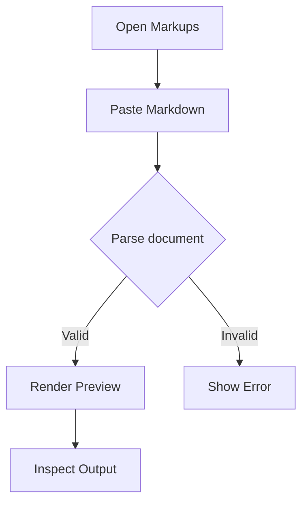
```mermaid
flowchart TD
    A[Open Markups] --> B[Paste Markdown]
    B --> C{Parse document}
    C -->|Valid| D[Render Preview]
    C -->|Invalid| E[Show Error]
    D --> F[Inspect Output]
```

## Flowchart with subgraphs and styles

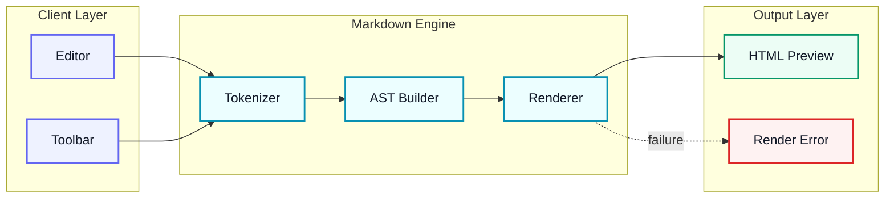
```mermaid
flowchart LR
    classDef input fill:#eef2ff,stroke:#6366f1,stroke-width:2px,color:#111827;
    classDef process fill:#ecfeff,stroke:#0891b2,stroke-width:2px,color:#111827;
    classDef success fill:#ecfdf5,stroke:#059669,stroke-width:2px,color:#111827;
    classDef danger fill:#fef2f2,stroke:#dc2626,stroke-width:2px,color:#111827;

    subgraph Client[Client Layer]
      A[Editor]:::input
      B[Toolbar]:::input
    end

    subgraph Engine[Markdown Engine]
      C[Tokenizer]:::process
      D[AST Builder]:::process
      E[Renderer]:::process
    end

    subgraph Output[Output Layer]
      F[HTML Preview]:::success
      G[Render Error]:::danger
    end

    A --> C
    B --> C
    C --> D --> E
    E --> F
    E -. failure .-> G
```

## Decision flow with edge labels

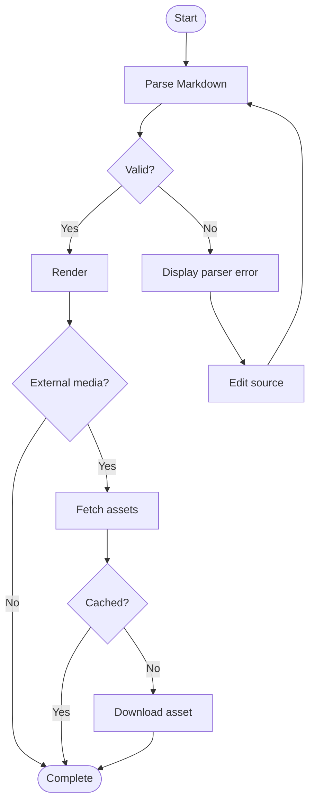
```mermaid
flowchart TD
    Start([Start]) --> Parse[Parse Markdown]
    Parse --> Valid{Valid?}
    Valid -->|Yes| Render[Render]
    Valid -->|No| Error[Display parser error]
    Render --> Media{External media?}
    Media -->|Yes| Fetch[Fetch assets]
    Media -->|No| Done([Complete])
    Fetch --> Cache{Cached?}
    Cache -->|Yes| Done
    Cache -->|No| Download[Download asset]
    Download --> Done
    Error --> Retry[Edit source]
    Retry --> Parse
```

---

# Mermaid Sequence Diagram

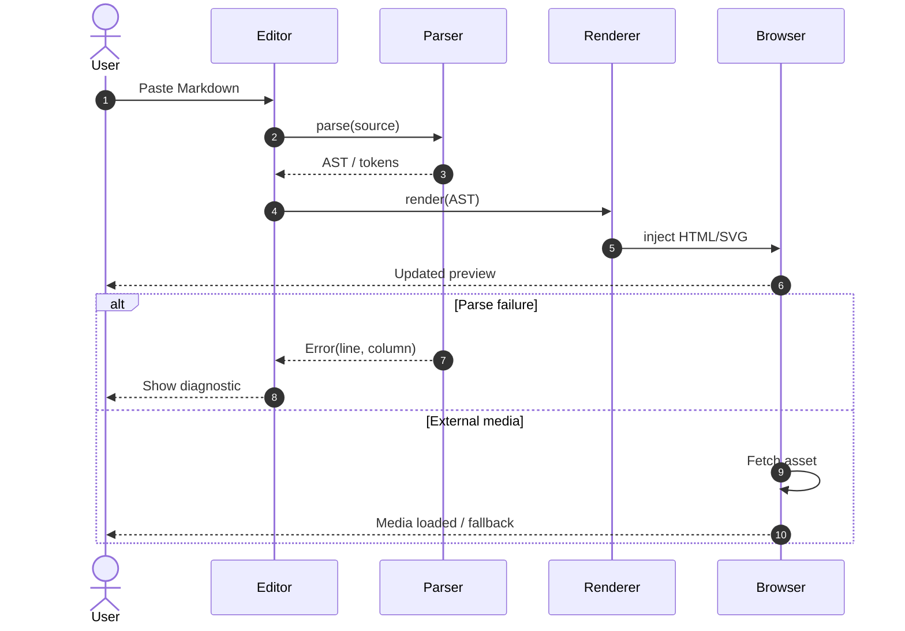
```mermaid
sequenceDiagram
    autonumber
    actor User
    participant Editor
    participant Parser
    participant Renderer
    participant Browser

    User->>Editor: Paste Markdown
    Editor->>Parser: parse(source)
    Parser-->>Editor: AST / tokens
    Editor->>Renderer: render(AST)
    Renderer->>Browser: inject HTML/SVG
    Browser-->>User: Updated preview

    alt Parse failure
        Parser-->>Editor: Error(line, column)
        Editor-->>User: Show diagnostic
    else External media
        Browser->>Browser: Fetch asset
        Browser-->>User: Media loaded / fallback
    end
```

---

# Mermaid Class Diagram

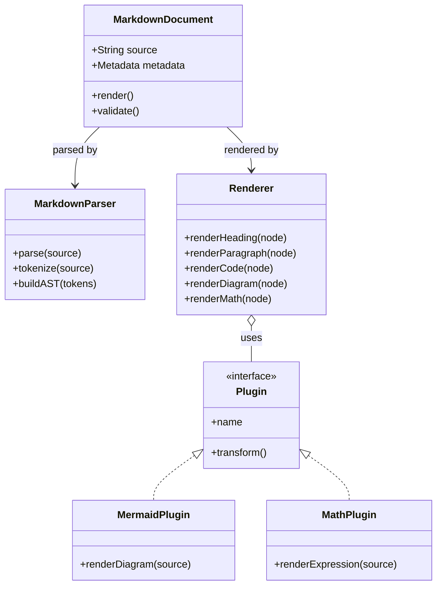
```mermaid
classDiagram
    class MarkdownDocument {
      +String source
      +Metadata metadata
      +render()
      +validate()
    }

    class MarkdownParser {
      +parse(source)
      +tokenize(source)
      +buildAST(tokens)
    }

    class Renderer {
      +renderHeading(node)
      +renderParagraph(node)
      +renderCode(node)
      +renderDiagram(node)
      +renderMath(node)
    }

    class Plugin {
      <<interface>>
      +name
      +transform()
    }

    class MermaidPlugin {
      +renderDiagram(source)
    }

    class MathPlugin {
      +renderExpression(source)
    }

    MarkdownDocument --> MarkdownParser : parsed by
    MarkdownDocument --> Renderer : rendered by
    Renderer o-- Plugin : uses
    Plugin <|.. MermaidPlugin
    Plugin <|.. MathPlugin
```

---

# Mermaid State Diagram

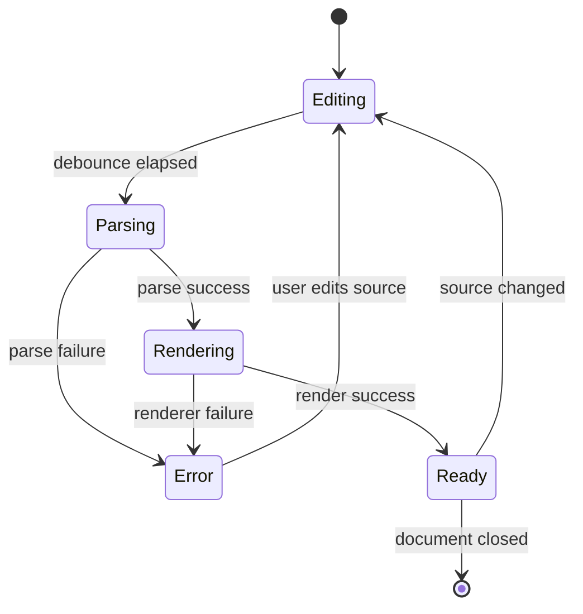
```mermaid
stateDiagram-v2
    [*] --> Editing
    Editing --> Parsing : debounce elapsed
    Parsing --> Rendering : parse success
    Parsing --> Error : parse failure
    Rendering --> Ready : render success
    Rendering --> Error : renderer failure
    Error --> Editing : user edits source
    Ready --> Editing : source changed
    Ready --> [*] : document closed
```

---

# Mermaid ER Diagram

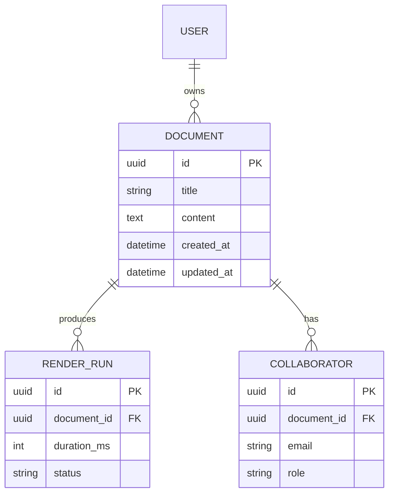
```mermaid
erDiagram
    USER ||--o{ DOCUMENT : owns
    DOCUMENT ||--o{ RENDER_RUN : produces
    DOCUMENT ||--o{ COLLABORATOR : has
    DOCUMENT {
      uuid id PK
      string title
      text content
      datetime created_at
      datetime updated_at
    }
    RENDER_RUN {
      uuid id PK
      uuid document_id FK
      int duration_ms
      string status
    }
    COLLABORATOR {
      uuid id PK
      uuid document_id FK
      string email
      string role
    }
```

---

# Mermaid Gantt

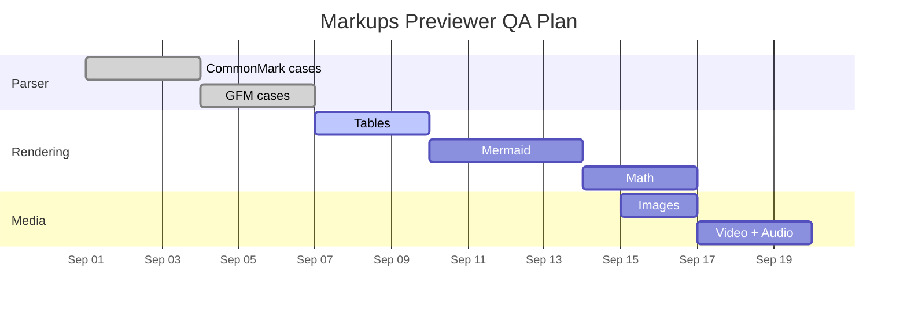
```mermaid
gantt
    title Markups Previewer QA Plan
    dateFormat  YYYY-MM-DD
    axisFormat  %b %d

    section Parser
    CommonMark cases        :done, parser1, 2026-09-01, 3d
    GFM cases               :done, parser2, after parser1, 3d

    section Rendering
    Tables                  :active, render1, 2026-09-07, 3d
    Mermaid                 :render2, after render1, 4d
    Math                    :render3, after render2, 3d

    section Media
    Images                  :media1, 2026-09-15, 2d
    Video + Audio           :media2, after media1, 3d
```

---

# Mermaid Pie

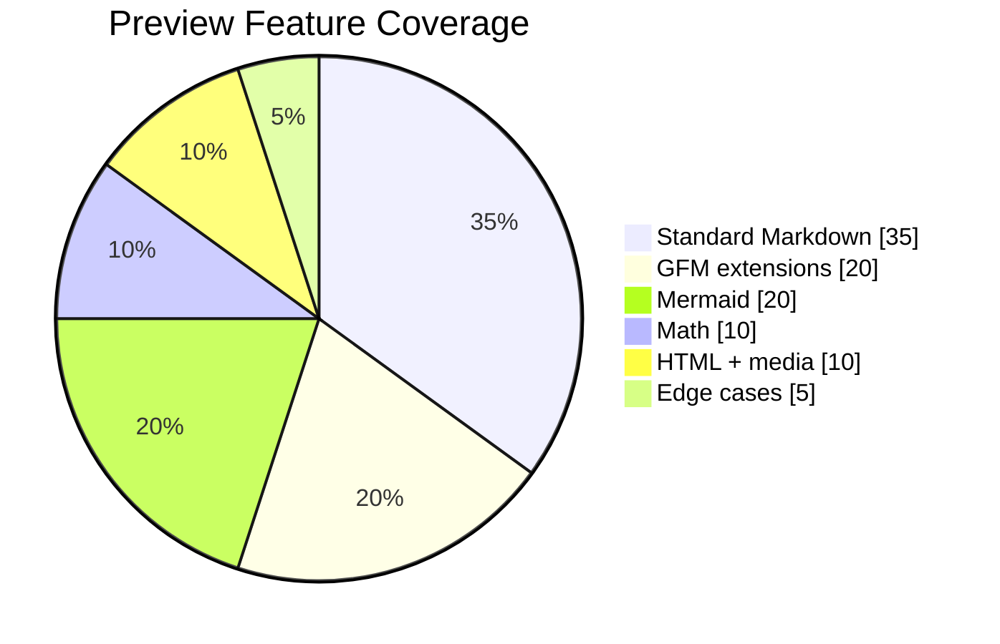
```mermaid
pie showData
    title Preview Feature Coverage
    "Standard Markdown" : 35
    "GFM extensions" : 20
    "Mermaid" : 20
    "Math" : 10
    "HTML + media" : 10
    "Edge cases" : 5
```

---

# Mermaid Journey

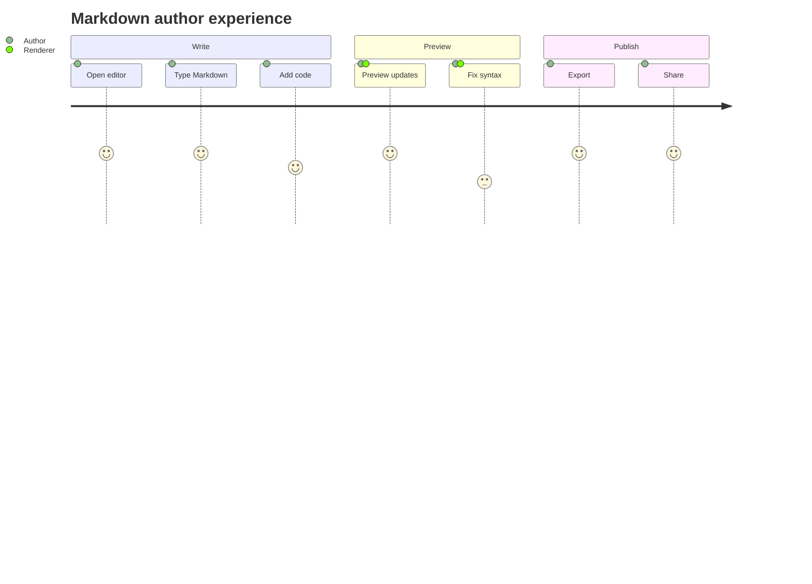
```mermaid
journey
    title Markdown author experience
    section Write
      Open editor: 5: Author
      Type Markdown: 5: Author
      Add code: 4: Author
    section Preview
      Preview updates: 5: Author, Renderer
      Fix syntax: 3: Author, Renderer
    section Publish
      Export: 5: Author
      Share: 5: Author
```

---

# Mermaid Mindmap

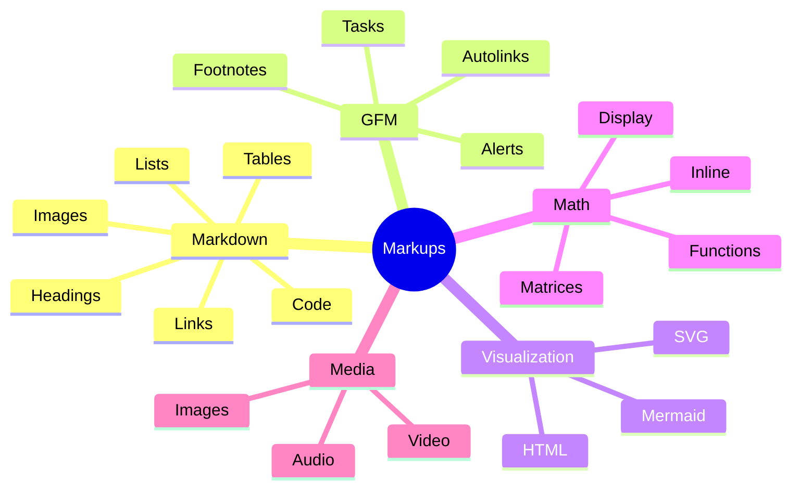
```mermaid
mindmap
  root((Markups))
    Markdown
      Headings
      Lists
      Tables
      Links
      Images
      Code
    GFM
      Alerts
      Tasks
      Footnotes
      Autolinks
    Visualization
      Mermaid
      SVG
      HTML
    Math
      Inline
      Display
      Matrices
      Functions
    Media
      Images
      Video
      Audio
```

---

# Mermaid Timeline

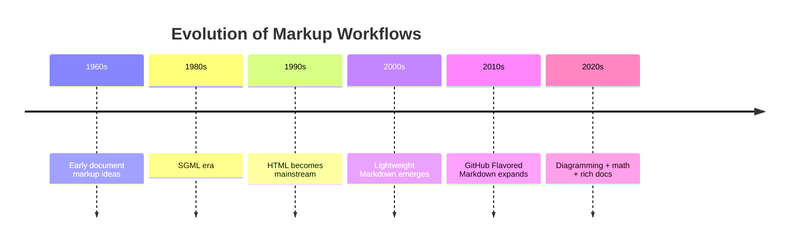
```mermaid
timeline
    title Evolution of Markup Workflows
    1960s : Early document markup ideas
    1980s : SGML era
    1990s : HTML becomes mainstream
    2000s : Lightweight Markdown emerges
    2010s : GitHub Flavored Markdown expands
    2020s : Diagramming + math + rich docs
```

---

# Mermaid XY Chart

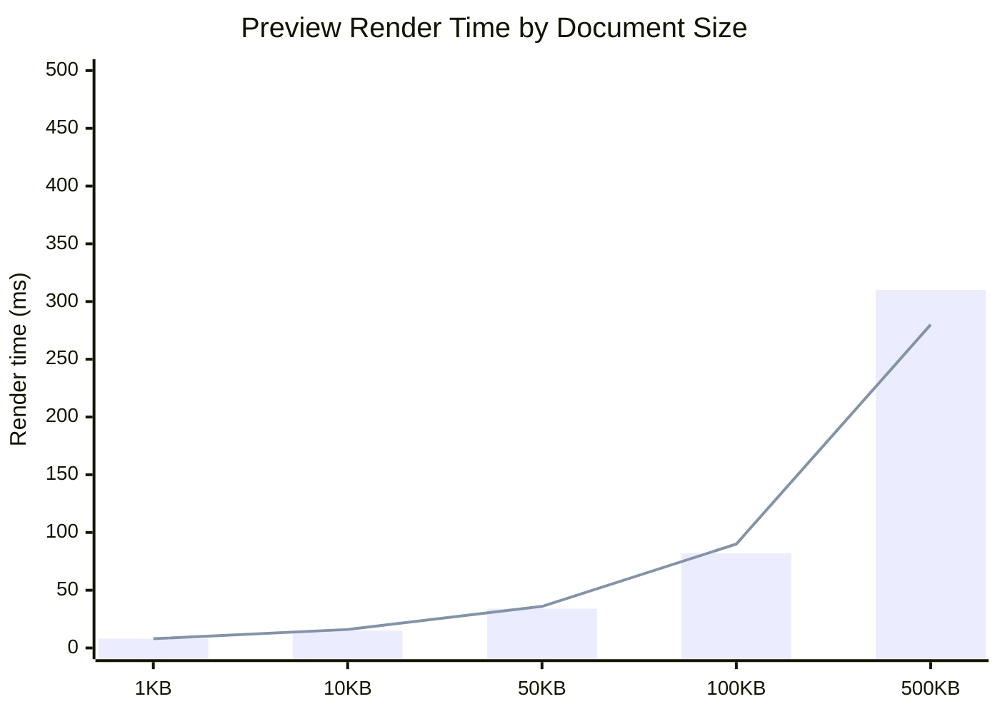
```mermaid
xychart-beta
    title "Preview Render Time by Document Size"
    x-axis [1KB, 10KB, 50KB, 100KB, 500KB]
    y-axis "Render time (ms)" 0 --> 500
    bar [8, 15, 34, 82, 310]
    line [8, 16, 36, 90, 280]
```

---

# Mermaid Quadrant

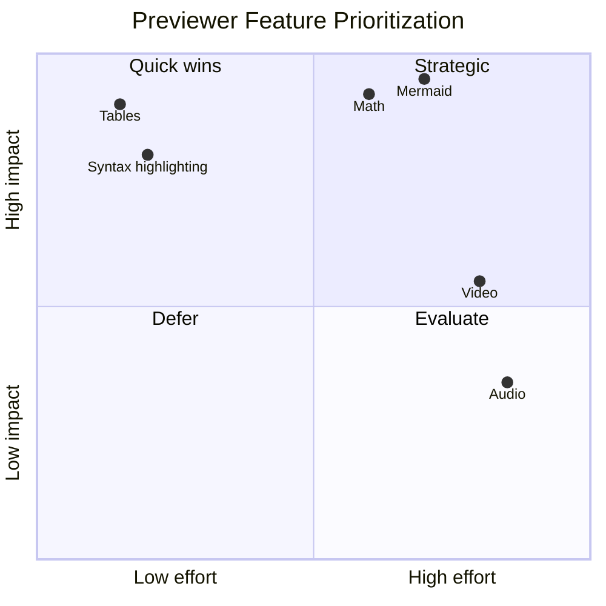
```mermaid
quadrantChart
    title Previewer Feature Prioritization
    x-axis Low effort --> High effort
    y-axis Low impact --> High impact
    quadrant-1 Strategic
    quadrant-2 Quick wins
    quadrant-3 Defer
    quadrant-4 Evaluate
    Syntax highlighting: [0.20, 0.80]
    Tables: [0.15, 0.90]
    Mermaid: [0.70, 0.95]
    Math: [0.60, 0.92]
    Video: [0.80, 0.55]
    Audio: [0.85, 0.35]
```

---

# Mermaid Architecture

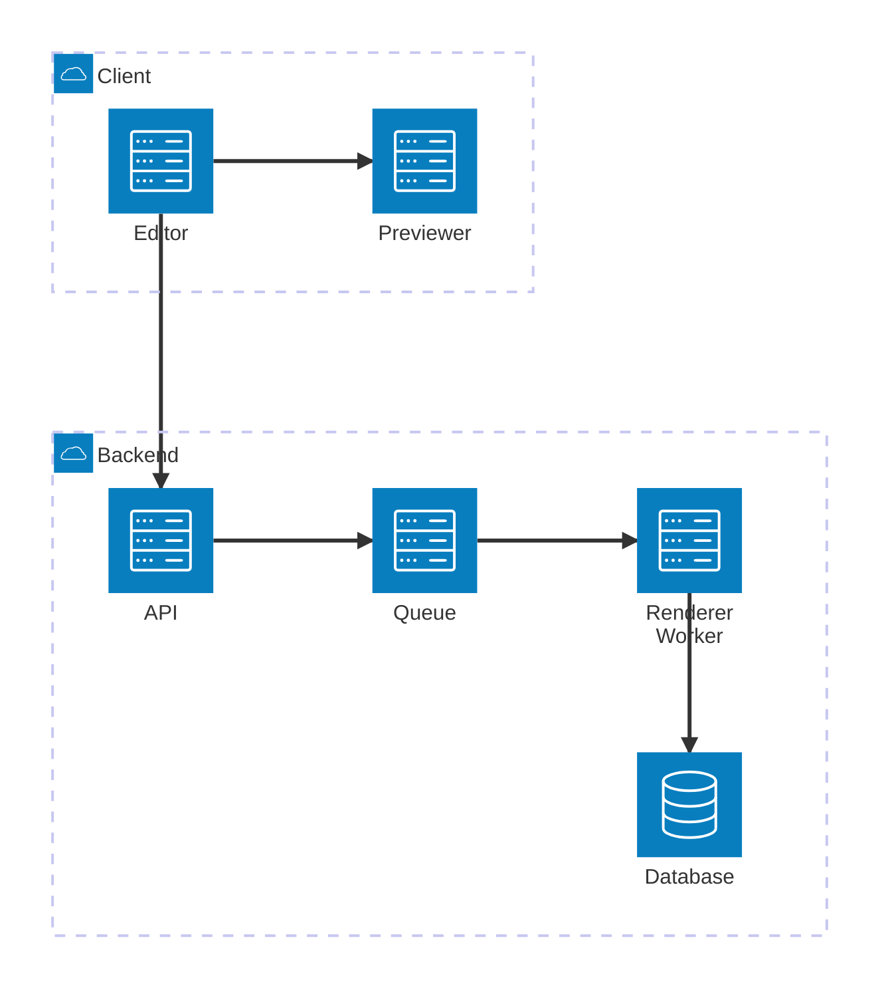
```mermaid
architecture-beta
    group client(cloud)[Client]
    service editor(server)[Editor] in client
    service preview(server)[Previewer] in client
    group backend(cloud)[Backend]
    service api(server)[API] in backend
    service queue(server)[Queue] in backend
    service worker(server)[Renderer Worker] in backend
    service db(database)[Database] in backend
    editor:R --> L:preview
    editor:B --> T:api
    api:R --> L:queue
    queue:R --> L:worker
    worker:B --> T:db
```

---

# Mermaid Git Graph

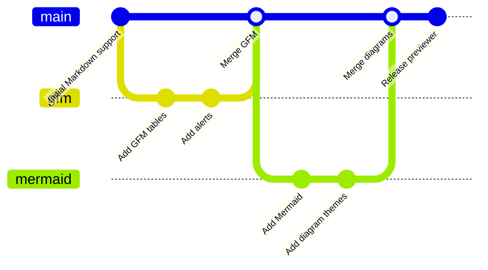
```mermaid
gitGraph
    commit id: "Initial Markdown support"
    branch gfm
    checkout gfm
    commit id: "Add GFM tables"
    commit id: "Add alerts"
    checkout main
    merge gfm id: "Merge GFM"
    branch mermaid
    checkout mermaid
    commit id: "Add Mermaid"
    commit id: "Add diagram themes"
    checkout main
    merge mermaid id: "Merge diagrams"
    commit id: "Release previewer"
```

---

# Mermaid Requirement Diagram

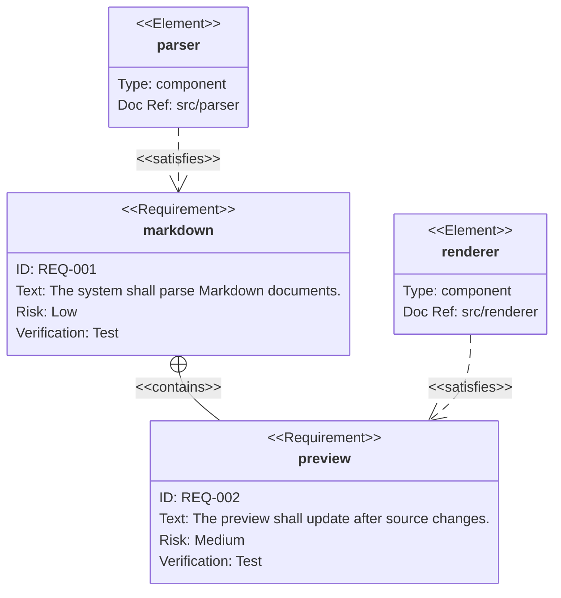
```mermaid
requirementDiagram
    requirement markdown {
      id: "REQ-001"
      text: "The system shall parse Markdown documents."
      risk: low
      verifymethod: test
    }

    requirement preview {
      id: "REQ-002"
      text: "The preview shall update after source changes."
      risk: medium
      verifymethod: test
    }

    element parser {
      type: component
      docRef: src/parser
    }

    element renderer {
      type: component
      docRef: src/renderer
    }

    markdown - contains -> preview
    parser - satisfies -> markdown
    renderer - satisfies -> preview
```

---

# GitHub-Specific Reference Probes

> These cases are useful for compatibility testing, but do not assume they should behave exactly the same outside GitHub.

## Issue / pull request / commit-like references

`#123`

`owner/repository#456`

`user@example.com`

`@octocat`

`deadbeef`

## Emoji shortcodes

:+1: :rocket: :warning: :tada: :sparkles: :bug: :white_check_mark: :x: :eyes: :shipit:

## Autolink-like references

https://github.com/markups/preview

https://docs.github.com/en/get-started/writing-on-github

## HTML details with Markdown content

<details>
<summary>GitHub-style documentation pattern</summary>

### Hidden implementation notes

This is a realistic README / issue-comment pattern.

- parser
- renderer
- sanitizer

</details>

## Mention-like prose

The maintainer can be referenced as **@octocat** in environments that support GitHub mentions.

---

# Raw HTML

## Semantic text elements

<p>This is an HTML paragraph inside Markdown.</p>

<p><strong>Strong HTML</strong>, <em>emphasis HTML</em>, <del>deleted HTML</del>, and <mark>highlight HTML</mark>.</p>

## Keyboard input

Press <kbd>Ctrl</kbd> + <kbd>Shift</kbd> + <kbd>P</kbd> to open a command palette.

## Abbreviation-style content

<p title="HyperText Markup Language">HTML</p>

## Center-like layout probe

<div align="center">
  <strong>Centered HTML block</strong><br />
  A previewer should handle this predictably, or sanitize it safely.
</div>

## HTML table

<table>
  <thead>
    <tr>
      <th>Metric</th>
      <th>Value</th>
    </tr>
  </thead>
  <tbody>
    <tr>
      <td>Render latency</td>
      <td>142 ms</td>
    </tr>
    <tr>
      <td>Documents</td>
      <td>12,450</td>
    </tr>
  </tbody>
</table>

## Horizontal rule in HTML

<hr />

---

# Media

> **Network test:** The media in this section intentionally uses external public demo assets. A renderer can be technically correct even when a browser blocks a remote asset, but it should show a graceful fallback rather than a broken layout.

## Markdown image again


## HTML image


## Responsive image source probe

<picture>
  <source media="(min-width: 1000px)" srcset="https://picsum.photos/seed/wide-picture/1200/500" />
  <source media="(min-width: 600px)" srcset="https://picsum.photos/seed/medium-picture/900/600" />
  
</picture>

## HTML video probe

<video controls width="720" preload="metadata">
  <source src="https://interactive-examples.mdn.mozilla.net/media/cc0-videos/flower.mp4" type="video/mp4" />
  Your browser does not support embedded video.
</video>

## Video fallback in plain Markdown link

[Open demo video](https://interactive-examples.mdn.mozilla.net/media/cc0-videos/flower.mp4)

## HTML audio probe

<audio controls preload="metadata">
  <source src="https://interactive-examples.mdn.mozilla.net/media/cc0-audio/t-rex-roar.mp3" type="audio/mpeg" />
  Your browser does not support embedded audio.
</audio>

## Audio fallback

[Open demo audio](https://interactive-examples.mdn.mozilla.net/media/cc0-audio/t-rex-roar.mp3)

---

# Color and Visual Styling Probes

## Standard HTML colors

<span style="color:#dc2626">Red text</span>

<span style="color:#16a34a">Green text</span>

<span style="color:#2563eb">Blue text</span>

<span style="color:#9333ea">Purple text</span>

## Background highlights

<span style="background:#fef08a;color:#111827;padding:2px 6px;border-radius:4px">Highlighted label</span>

<span style="background:#dcfce7;color:#166534;padding:2px 6px;border-radius:4px">Success badge</span>

<span style="background:#fee2e2;color:#991b1b;padding:2px 6px;border-radius:4px">Error badge</span>

## Inline color matrix

| Semantic | Sample |
| --- | --- |
| Primary | <span style="color:#2563eb">Blue</span> |
| Success | <span style="color:#16a34a">Green</span> |
| Warning | <span style="color:#ca8a04">Amber</span> |
| Danger | <span style="color:#dc2626">Red</span> |
| Muted | <span style="color:#6b7280">Gray</span> |

## SVG probe

<svg width="480" height="140" viewBox="0 0 480 140" role="img" aria-label="Simple SVG preview test" xmlns="http://www.w3.org/2000/svg">
  <rect x="10" y="10" width="460" height="120" rx="18" fill="#eff6ff" stroke="#2563eb" stroke-width="3" />
  <circle cx="90" cy="70" r="28" fill="#22c55e" />
  <circle cx="160" cy="70" r="28" fill="#f59e0b" />
  <circle cx="230" cy="70" r="28" fill="#ef4444" />
  <text x="280" y="78" font-family="Arial, sans-serif" font-size="22" fill="#111827">SVG Preview Test</text>
</svg>

---

# Research-Paper Style Content

## Abstract

This document evaluates the behavior of a modern Markdown preview pipeline under a broad set of syntax and rendering conditions. The test corpus spans structural Markdown, GitHub-oriented extensions, mathematics, diagrams, media, embedded HTML, syntax-highlighted source code, and intentionally adversarial edge cases. The objective is not to prescribe one renderer, but to expose differences between parsing, sanitization, layout, interaction, and browser-level rendering.

**Keywords:** Markdown, CommonMark, GitHub Flavored Markdown, previewer, Mermaid, mathematics, KaTeX, HTML sanitization, visual regression.

## 1. Introduction

Markdown is frequently used for README files, technical documentation, issue trackers, research notes, changelogs, internal specifications, and long-form developer writing. A practical previewer therefore needs to handle more than headings and paragraphs. It needs predictable behavior across nested blocks, code, links, media, tables, diagrams, and malformed input.

## 2. Research Questions

1. Does the parser preserve the intended document structure?
2. Does the renderer produce stable HTML/SVG output?
3. Are mathematical expressions displayed without disrupting surrounding prose?
4. Are diagrams isolated from regular fenced code blocks?
5. Does media failure produce a usable fallback?
6. Does sanitization prevent unsafe HTML or scripting while retaining useful markup?
7. Are long tables and long code lines handled without breaking layout?

## 3. Methodology

The corpus is organized into functional families. Each family contains both nominal examples and stress cases. A useful test procedure is to compare the output from Markups with an independent renderer, then record parser differences separately from visual differences.

### 3.1 Dataset

The corpus includes:

- 6 heading levels
- multiple emphasis combinations
- nested lists and blockquotes
- aligned and wide tables
- task lists
- alert-style blockquotes
- collapsible details
- footnotes
- language-tagged code blocks
- mathematical expressions
- multiple Mermaid diagram classes
- Markdown and HTML images
- HTML video and audio probes
- color, badge, SVG, and inline HTML probes
- malformed and ambiguous punctuation cases

## 4. Evaluation Dimensions

| Dimension | Meaning | Suggested metric |
| --- | --- | ---: |
| Parse fidelity | Source structure is preserved | % matching AST nodes |
| Visual fidelity | Rendered appearance matches reference | similarity score |
| Interaction | Links, details, controls, copy buttons work | pass/fail |
| Accessibility | Semantics and alternatives survive | audit score |
| Performance | Preview stays responsive | p95 render time |
| Safety | Unsafe HTML is sanitized | exploit test pass rate |

## 5. Example Results

A hypothetical result matrix might look like this:

| Corpus | Pass | Warning | Fail | Coverage |
| --- | ---: | ---: | ---: | ---: |
| Core Markdown | 142 | 3 | 0 | 100% |
| GFM | 84 | 6 | 2 | 96% |
| Mermaid | 10 | 2 | 1 | 92% |
| Math | 18 | 1 | 0 | 100% |
| Media | 7 | 3 | 1 | 71% |

## 6. Conclusion

A previewer becomes significantly easier to maintain when parsing, transformation, diagram rendering, sanitization, media resolution, and visual layout are treated as distinct layers. This corpus is designed to expose failures at those boundaries.

## 7. References

1. CommonMark specification: https://spec.commonmark.org/
2. GitHub writing and formatting documentation: https://docs.github.com/en/get-started/writing-on-github/getting-started-with-writing-and-formatting-on-github
3. Mermaid documentation: https://mermaid.js.org/
4. Math rendering documentation: https://docs.github.com/en/get-started/writing-on-github/working-with-advanced-formatting/writing-mathematical-expressions

---

# README-Style Product Content

<div align="center">

# 🚀 Markups

### A fast, modern Markdown workspace with live preview

**Write. Preview. Diagram. Calculate. Export. Share.**

[Website](https://markups.dev) · [GitHub](https://github.com/) · [Docs](https://docs.github.com/)

</div>

## ✨ Features

| Feature | Description |
| --- | --- |
| Live preview | Render while you write |
| Mermaid | Flowcharts, sequence diagrams, architecture diagrams and more |
| Math | LaTeX-style mathematical notation |
| Syntax highlighting | Developer-friendly code blocks |
| Tables | Alignment, wrapping and rich cell content |
| Export | PDF / HTML / DOCX workflows |
| Responsive | Desktop and mobile-friendly reading |

## 🚀 Quick Start

```bash
# Install dependencies
npm install

# Run locally
npm run dev

# Create a production build
npm run build
npm run start
```

## Architecture

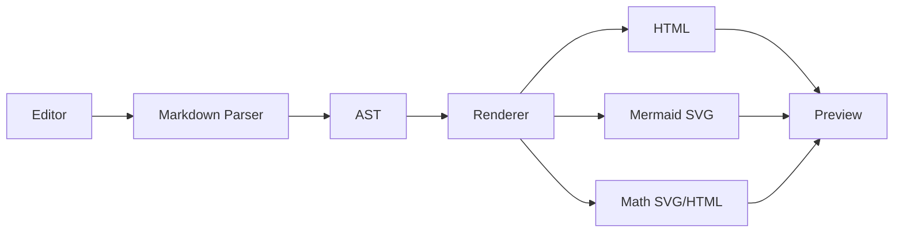
```mermaid
flowchart LR
    A[Editor] --> B[Markdown Parser]
    B --> C[AST]
    C --> D[Renderer]
    D --> E[HTML]
    D --> F[Mermaid SVG]
    D --> G[Math SVG/HTML]
    E --> H[Preview]
    F --> H
    G --> H
```

## Environment variables

```env
NEXT_PUBLIC_APP_URL=https://markups.dev
NEXT_PUBLIC_ANALYTICS_ENABLED=true
RENDER_TIMEOUT_MS=1500
MAX_DOCUMENT_SIZE_MB=20
```

## License

> Replace this section with the actual license text before publishing.

---

# Real-World Technical Documentation

## API Endpoint Example

### `POST /api/documents/render`

**Request:**

```json
{
  "markdown": "# Hello world",
  "options": {
    "gfm": true,
    "mermaid": true,
    "math": true
  }
}
```

**Response:**

```json
{
  "html": "<h1>Hello world</h1>",
  "warnings": [],
  "renderTimeMs": 19
}
```

### cURL

```bash
curl -X POST \
  -H 'Content-Type: application/json' \
  -d '{"markdown":"# Hello"}' \
  https://example.com/api/documents/render
```

## Configuration Matrix

| Option | Type | Default | Description |
| --- | --- | --- | --- |
| `gfm` | boolean | `true` | Enable GFM-like extensions |
| `mermaid` | boolean | `true` | Render Mermaid fenced blocks |
| `math` | boolean | `true` | Render mathematical expressions |
| `sanitizeHtml` | boolean | `true` | Sanitize raw HTML |
| `externalMedia` | boolean | `false` | Permit remote media |

## Error example

```text
RenderError: Mermaid diagram failed to parse
  at renderDiagram (renderer.js:142:11)
  at renderNode (renderer.js:87:5)
  at renderDocument (renderer.js:31:3)

Hint: check the diagram type and syntax.
```

---

# JSON/YAML/XML/SQL/Shell Fixtures

## JSON array

```json
[
  {
    "id": "doc_001",
    "tags": ["markdown", "gfm", "mermaid"],
    "metrics": {
      "views": 1204,
      "exports": 92,
      "shares": 17
    }
  },
  {
    "id": "doc_002",
    "tags": [],
    "metrics": {
      "views": 0,
      "exports": 0,
      "shares": 0
    }
  }
]
```

## YAML list

```yaml
services:
  - name: editor
    port: 3000
  - name: renderer
    port: 4000
  - name: worker
    port: 5000

healthcheck:
  interval: 30s
  timeout: 5s
  retries: 3
```

## XML

```xml
<?xml version="1.0" encoding="UTF-8"?>
<document>
  <title>Markups Test</title>
  <feature enabled="true">Mermaid</feature>
</document>
```

## SQL schema

```sql
CREATE TABLE documents (
    id UUID PRIMARY KEY,
    title TEXT NOT NULL,
    content TEXT NOT NULL,
    created_at TIMESTAMP NOT NULL DEFAULT CURRENT_TIMESTAMP,
    updated_at TIMESTAMP NOT NULL DEFAULT CURRENT_TIMESTAMP
);
```

## Shell command matrix

```bash
# Inspect git state
git status --short

# View the latest commit
git log -1 --oneline

# Search Markdown files
grep -R "mermaid" -n . --include='*.md'

# Find large Markdown files
find . -name '*.md' -type f -size +1M -print
```

---

# Edge Cases and Parser Traps

## Asterisks

*italic*

**bold**

***bold italic***

\*literal asterisk\*

## Underscores

hello_world_should_not_be_italic

_italic_

__bold__

## Empty emphasis candidates

****

____

## Escaped punctuation

\# not heading

\> not quote

\- not list

\+ not list

\1. not ordered list

## Angle brackets

Use `<` and `>` as ordinary operators: `a < b && b > c`.

HTML-like text without a valid tag: `<not-a-real-tag>`.

## Ampersands

Raw ampersand: A & B.

Entity: AT&amp;T.

## Quotes

"Double quotes" and 'single quotes' and `inline code`.

## URLs with punctuation

https://example.com/path?q=one&value=two

(https://example.com/path)

## Parentheses in URLs

[Wikipedia](https://en.wikipedia.org/wiki/Markdown_(markup_language))

## Long unbroken string

`ABCDEFGHIJKLMNOPQRSTUVWXYZabcdefghijklmnopqrstuvwxyz0123456789ABCDEFGHIJKLMNOPQRSTUVWXYZabcdefghijklmnopqrstuvwxyz0123456789ABCDEFGHIJKLMNOPQRSTUVWXYZabcdefghijklmnopqrstuvwxyz0123456789`

## Very long inline text to check wrapping behavior

AAAAAAAAAAAAAAAAAAAAAAAAAAAAAAAAAAAAAAAAAAAAAAAAAAAAAAAAAAAAAAAAAAAAAAAAAAAAAAAAAAAAAAAAAAAAAAAAAAAAAAAAAAAAAAAAAAAAAAAAAAAAAAAAAAAAAAAAAAAAAAAAAAAAAAAAAAAAAAAAAAAAAAAAAAAAAAAAAAAAAAAAAAAAAAAAAAAAAAAAAAAAAAAAAAAAAAAAAAAAAAAAAAAAAAAAAAAAAAAAAAAAAAAAAAAAAAAAAAAAAAAAAAAAAAAAAAAAAAAAAAAAAAAAAAAAAAAAAAAAAAAAAAAAAAAAAAAAAAAAAAAA

## Long code line

```text
This_is_an_intentionally_long_unbroken_line_to_test_horizontal_scrolling_or_soft_wrapping_in_the_code_block_without_causing_the_entire_preview_page_to_overflow_ABCDEFGHIJKLMNOPQRSTUVWXYZ_1234567890_test_test_test_test_test_test_test_test_test_test_test_test_test_test_test_test
```

## Unusual list markers

- item
  - nested

1. item
   - nested

- [ ] unchecked
- [x] checked

## Empty links / images (should remain stable, not crash)

[]()


## Backtick stress

`one`

``two``

```three```

````four````

## Fence collision test

````text
```
This inner fence must remain literal.
```
````

## Blockquote continuation

> Quote line one
> quote line two
>
> quote paragraph two

## Table weird spacing

|A|B|C|
|-|-|-|
|1|2|3|

## Table with formatting

| Feature | Value |
| --- | --- |
| **Bold** | *Italic* |
| `Code` | [Link](https://example.com) |
| ~~Old~~ | <mark>Highlight</mark> |

## Horizontal-rule ambiguity

Text above

---

Text below

## The word "end" inside Mermaid node labels

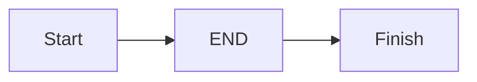
```mermaid
flowchart LR
    A[Start] --> B[END]
    B --> C[Finish]
```

## Mermaid special edge markers

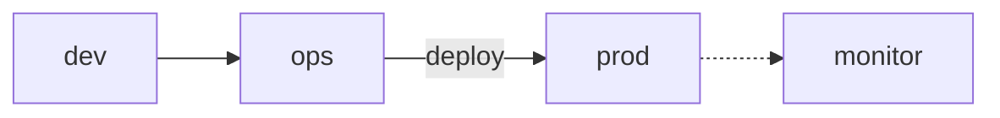
```mermaid
flowchart LR
    dev --> ops
    ops -->|deploy| prod
    prod -.-> monitor
```

---

# Accessibility Probes

## Images with good alt text


## Decorative image with empty alt


## Heading hierarchy

The document intentionally includes many nested heading levels. Check that heading order, IDs, and navigation remain sensible.

## Semantic HTML

<article>
  <header>
    <h3>Accessible semantic container</h3>
  </header>
  <p>This section tests whether semantic HTML remains readable and whether dangerous HTML is correctly sanitized.</p>
  <footer>End of semantic sample.</footer>
</article>

## Form controls probe

<label for="demo-name">Name</label>
<input id="demo-name" name="demo-name" type="text" placeholder="Preview should not execute arbitrary form actions" />

---

# Rendering QA Checklist

Use this checklist while looking at the Markups preview.

## Structure

- [ ] H1–H6 hierarchy is correct
- [ ] Setext headings work
- [ ] Paragraph spacing is consistent
- [ ] Horizontal rules are visually balanced
- [ ] Anchors/TOC links navigate correctly
- [ ] Long content does not overflow the page

## Typography

- [ ] Bold / italic / bold-italic are distinct
- [ ] Strikethrough is visible
- [ ] Inline code has clear contrast
- [ ] `<mark>`, `<kbd>`, `<sub>`, `<sup>` look correct
- [ ] Quotes have proper indentation

## Lists

- [ ] Unordered lists nest correctly
- [ ] Ordered lists nest correctly
- [ ] Task list checkboxes align
- [ ] Mixed content inside list items remains stable

## Tables

- [ ] Left / center / right alignment works
- [ ] Wide tables scroll or wrap safely
- [ ] Long text wraps correctly
- [ ] Inline Markdown inside cells renders
- [ ] Escaped pipes remain inside cells

## GFM-like features

- [ ] Alerts render as distinct callouts
- [ ] Footnotes render and link back
- [ ] `<details>` expands/collapses
- [ ] Code fences highlight correctly

## Math

- [ ] Inline math is rendered, not shown as raw delimiters
- [ ] Display equations are centered/readable
- [ ] Matrix renders correctly
- [ ] Greek letters render correctly
- [ ] Superscripts/subscripts work
- [ ] Escaped dollar signs do not break parsing

## Mermaid

- [ ] Flowchart
- [ ] Styled flowchart
- [ ] Sequence diagram
- [ ] Class diagram
- [ ] State diagram
- [ ] ER diagram
- [ ] Gantt
- [ ] Pie
- [ ] Journey
- [ ] Mindmap
- [ ] Timeline
- [ ] XY chart
- [ ] Quadrant chart
- [ ] Architecture diagram
- [ ] Git graph
- [ ] Requirement diagram

## HTML and security

- [ ] Safe HTML renders predictably
- [ ] Unsupported HTML fails gracefully
- [ ] Inline styles behave according to product policy
- [ ] SVG behaves according to product policy
- [ ] Scripts are never executed from untrusted Markdown
- [ ] Event-handler attributes are sanitized
- [ ] Unsafe URLs are handled safely
- [ ] Forms do not create unexpected submission behavior

## Media

- [ ] Images preserve aspect ratio
- [ ] Alt text is preserved
- [ ] Broken images have a useful fallback
- [ ] Video controls are visible
- [ ] Video failure does not collapse the layout
- [ ] Audio controls are visible
- [ ] Audio failure does not break the document

## Code UX

- [ ] Code blocks use monospace typography
- [ ] Syntax highlighting is consistent
- [ ] Very long lines scroll or wrap predictably
- [ ] Copy button, if present, copies exact source
- [ ] Nested fences render correctly

## Performance

- [ ] Live preview remains responsive while typing
- [ ] Large code blocks do not freeze the UI
- [ ] Mermaid diagrams do not block the rest of the page
- [ ] Math-heavy documents remain usable
- [ ] External media loading does not block text rendering

---

# Final Diagnostic Matrix

| Area | Expected result | Observed result |
| --- | --- | --- |
| Common Markdown | Correct structure | ⬜ |
| GFM tables | Correct alignment | ⬜ |
| Task lists | Interactive-looking checkbox rendering | ⬜ |
| Alerts | Distinct callouts | ⬜ |
| Footnotes | Linked references + notes | ⬜ |
| Details | Expand/collapse | ⬜ |
| Syntax highlighting | Language-aware colors | ⬜ |
| Math | Proper equation rendering | ⬜ |
| Mermaid | SVG diagram rendering | ⬜ |
| Images | Correct sizing + alt | ⬜ |
| Video | Browser controls | ⬜ |
| Audio | Browser controls | ⬜ |
| HTML | Sanitized/predictable | ⬜ |
| SVG | Safe and correctly sized | ⬜ |
| Colors | Product policy respected | ⬜ |
| Long lines | No page-breaking overflow | ⬜ |
| Anchors | Navigation works | ⬜ |
| Dark mode | Contrast remains accessible | ⬜ |
| Mobile | Layout remains usable | ⬜ |

---

# Notes for the Renderer Author

This corpus deliberately includes both broadly portable Markdown and renderer-specific extensions. A previewer should not silently pretend that every feature is part of CommonMark.

A useful compatibility model is:

```text
CommonMark core
   │
   ├── GitHub-style extensions
   │      ├── tables
   │      ├── task lists
   │      ├── autolinks
   │      ├── strikethrough
   │      ├── footnotes
   │      └── alerts
   │
   ├── Math extension
   │      ├── inline math
   │      └── block math
   │
   ├── Diagram extension
   │      └── Mermaid
   │
   └── HTML layer
          ├── semantic tags
          ├── media
          ├── SVG
          └── sanitization boundary
```

The most important QA distinction is **parse correctness vs. render correctness vs. security correctness**. A syntactically valid block can still be visually broken, and an HTML construct that renders is not automatically safe for untrusted user content.

---

# End of Stress Test

**Markups preview test complete.** ✅

Use the section headings as checkpoints. When something fails, record:

`source → parser result → rendered output → console error → expected behavior`

That gives you a clean bug report instead of only a screenshot.
