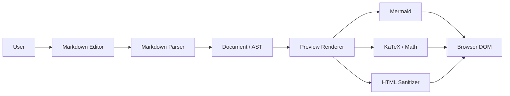
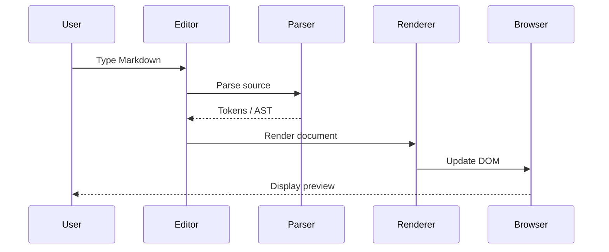
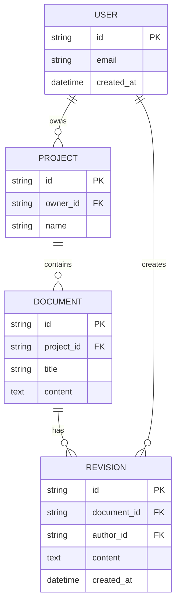
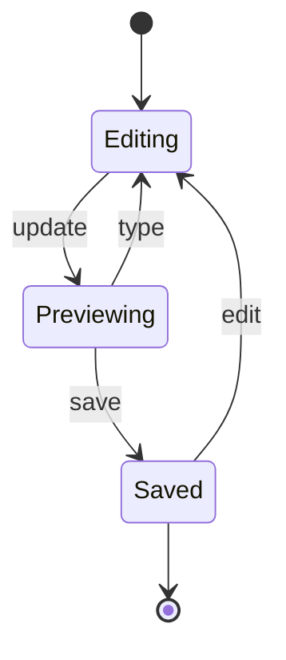
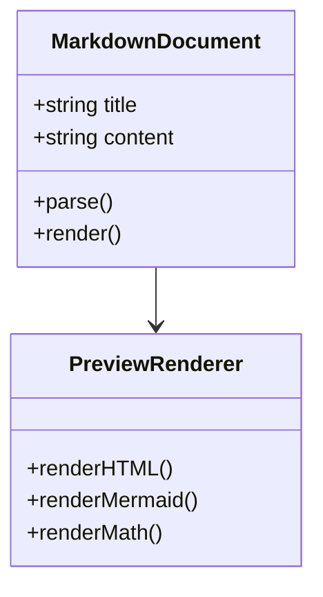
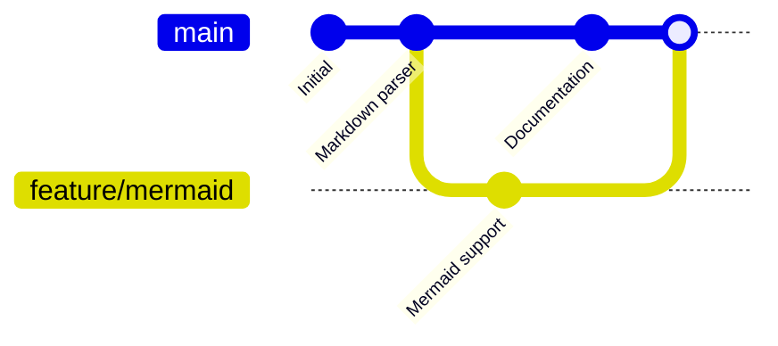
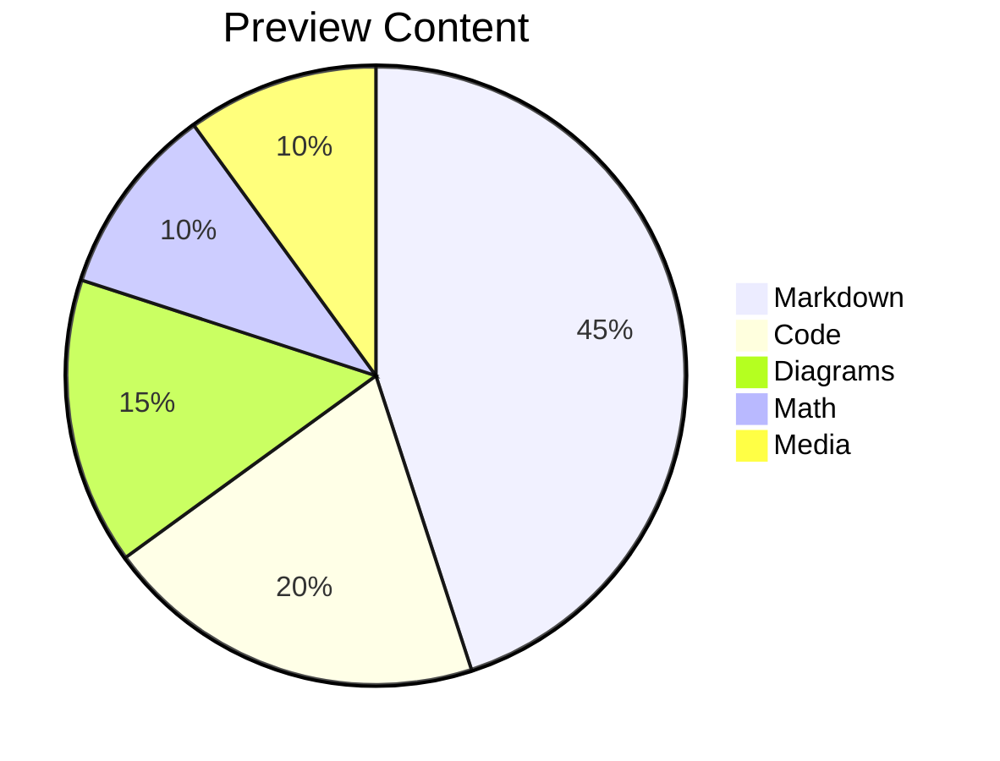
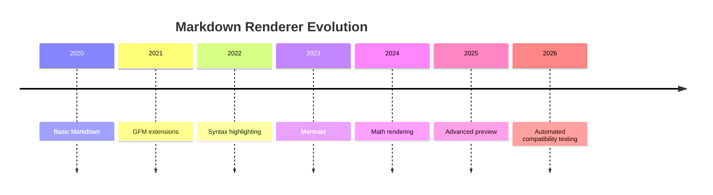
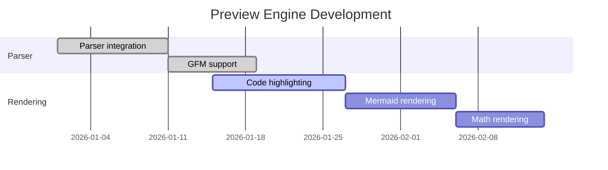
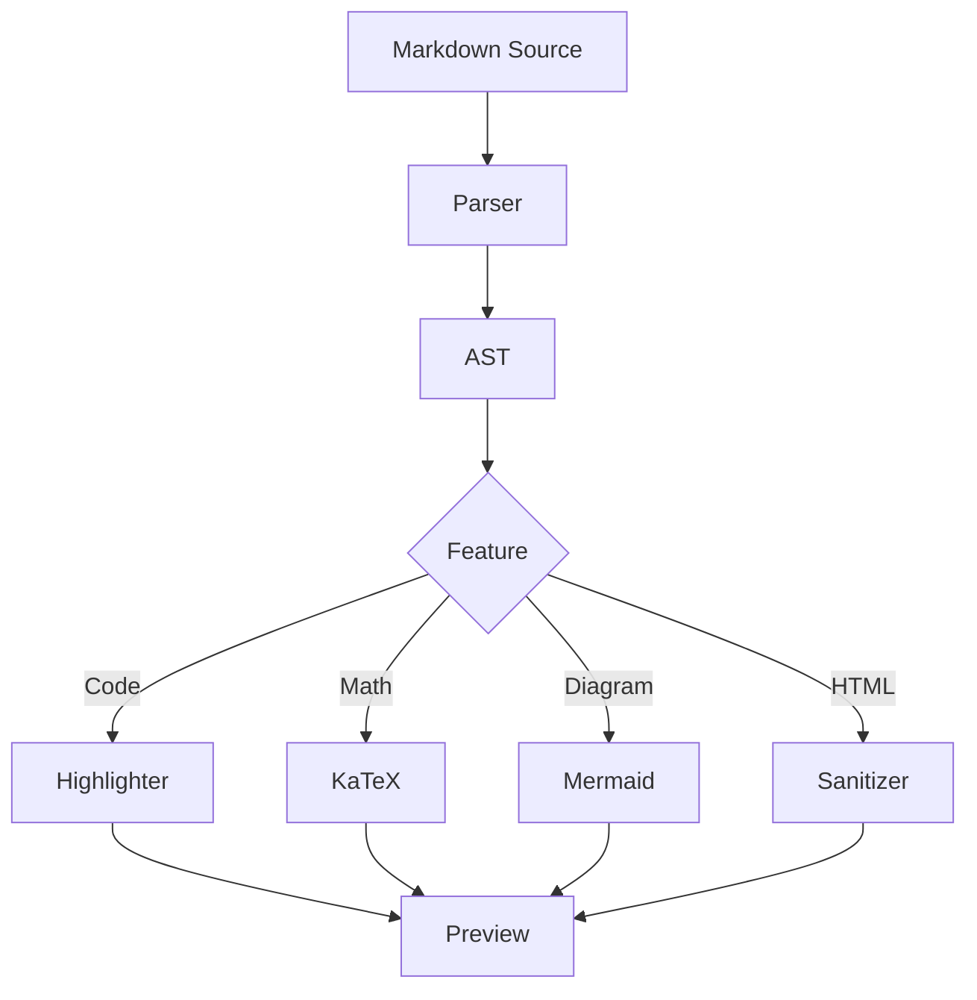

# Real-World Markdown Test Pack

> Original content designed to imitate real Markdown used in GitHub READMEs, technical docs, research notes, tutorials, blogs, API documentation, and project specifications.

---

# 1. Open-Source README

## Markups Preview Engine

Markups is a Markdown editor focused on a fast editing and preview workflow.

### Features

- Live Markdown preview
- GitHub-style formatting
- Syntax-highlighted code
- Mermaid diagrams
- Mathematical notation
- Tables and task lists
- Images and external media
- Export workflows
- Responsive preview

### Installation

```bash
git clone https://example.com/markups.git
cd markups
npm install
npm run dev
```

### Quick example

```javascript
const markdown = "# Hello Markups";

function renderPreview(source) {
  return parser.render(source);
}

console.log(renderPreview(markdown));
```

### Configuration

```json
{
  "theme": "system",
  "preview": {
    "syncScroll": true,
    "math": true,
    "mermaid": true
  }
}
```

### Checklist

- [x] Markdown parser configured
- [x] GFM enabled
- [x] Syntax highlighting enabled
- [x] Mermaid enabled
- [ ] Export regression tests
- [ ] Mobile visual regression

---

# 2. Technical API Documentation

## Authentication

The API uses bearer-token authentication.

```http
POST /api/v1/auth/login
Content-Type: application/json

{
  "email": "developer@example.com",
  "password": "example-password"
}
```

Response:

```json
{
  "token": "eyJhbGciOiJIUzI1NiJ9...",
  "expiresIn": 3600
}
```

Use the token on subsequent requests:

```bash
curl https://api.example.com/v1/projects \
  -H "Authorization: Bearer $TOKEN"
```

### HTTP status codes

| Status | Meaning | Action |
| ---: | --- | --- |
| 200 | Success | Continue |
| 201 | Created | Store resource ID |
| 400 | Bad Request | Validate input |
| 401 | Unauthorized | Refresh credentials |
| 404 | Not Found | Check resource ID |
| 429 | Rate Limited | Retry with backoff |
| 500 | Server Error | Retry or report |

> [!NOTE]
> Rate limits are applied per authenticated account.

> [!WARNING]
> Never expose access tokens in client-side logs.

<details>
<summary>Advanced request example</summary>

```typescript
type CreateProjectInput = {
  name: string;
  description?: string;
  private?: boolean;
};

async function createProject(input: CreateProjectInput) {
  const response = await fetch("/api/v1/projects", {
    method: "POST",
    headers: {
      "Content-Type": "application/json"
    },
    body: JSON.stringify(input)
  });

  if (!response.ok) {
    throw new Error(`Request failed: ${response.status}`);
  }

  return response.json();
}
```

</details>

---

# 3. Architecture Documentation



## Request lifecycle



---

# 4. Database Documentation



---

# 5. Research-Style Document

## Abstract

Markdown rendering combines lexical parsing, document transformation, HTML generation, sanitization, and browser layout. A useful preview engine therefore needs to be evaluated not only on simple syntax but also on interactions between independent features.

## Research Question

How accurately can a browser-based Markdown renderer reproduce common technical-document patterns while maintaining predictable behavior for malformed input?

## Method

We evaluate:

1. Core Markdown syntax.
2. GitHub Flavored Markdown extensions.
3. Code highlighting.
4. Mathematical notation.
5. Diagram rendering.
6. Embedded media.
7. Raw HTML.
8. Responsive layout.
9. Error handling.
10. Large-document behavior.

## Mathematical Model

For a document with source size $n$, parsing can be approximated as:

$$
T(n) = T_{parse}(n) + T_{transform}(n) + T_{render}(n)
$$

For repeated preview updates:

$$
T_{total} = \sum_{i=1}^{k}
\left(
T_{parse,i} + T_{render,i}
\right)
$$

A renderer that reparses the complete document on every keystroke may exhibit different performance characteristics from an incremental renderer.

### Matrix

$$
A =
\begin{bmatrix}
1 & 2 & 3 \\
4 & 5 & 6 \\
7 & 8 & 9
\end{bmatrix}
$$

### Probability

$$
P(A \mid B) =
\frac{P(B \mid A)P(A)}
{P(B)}
$$

### Optimization

$$
\min_{\theta}
\frac{1}{N}
\sum_{i=1}^{N}
L(f_{\theta}(x_i), y_i)
$$

---

# 6. Technical Blog Style

## Why Markdown Preview Is Harder Than It Looks

A basic Markdown previewer appears simple:

```text
source -> parser -> HTML
```

In practice, the pipeline becomes closer to:

```text
source
  -> parser
  -> extensions
  -> AST transformations
  -> code highlighting
  -> math transformation
  -> diagram rendering
  -> sanitization
  -> DOM
  -> CSS layout
```

The difficult bugs are often interaction bugs.

For example, a Mermaid diagram may work perfectly by itself but fail when placed inside a collapsed `<details>` element. A wide table may render correctly on desktop but create horizontal page overflow on mobile.

### Decision table

| Scenario | Desktop | Mobile | Expected |
| --- | :---: | :---: | --- |
| Short paragraph | ✅ | ✅ | No overflow |
| Wide table | ✅ | ⚠️ | Scroll table, not page |
| Long URL | ✅ | ⚠️ | Wrap safely |
| Mermaid | ✅ | ✅ | Fit preview container |
| Large code block | ✅ | ✅ | Horizontal code scrolling |

---

# 7. Nested Content

> A blockquote can contain a list:
>
> - First item
> - Second item
>   - Nested item
>   - Another nested item
>
> And it can contain code:
>
> ```python
> def hello(name):
>     return f"Hello, {name}"
> ```

1. First step
   1. Nested step
   2. Another nested step
      - Mixed unordered item
      - Another item
2. Second step

---

# 8. Images


[](https://example.com)


---

# 9. Video and Audio

<video controls width="640">
  <source src="https://interactive-examples.mdn.mozilla.net/media/cc0-videos/flower.mp4" type="video/mp4">
  Your browser does not support HTML5 video.
</video>

<audio controls>
  <source src="https://interactive-examples.mdn.mozilla.net/media/cc0-audio/t-rex-roar.mp3" type="audio/mpeg">
  Your browser does not support HTML5 audio.
</audio>

---

# 10. More Mermaid

## State diagram



## Class diagram



## Git graph



## Pie chart



## Timeline



## Gantt



---

# 11. HTML Elements

<kbd>Ctrl</kbd> + <kbd>S</kbd>

<mark>Highlighted text</mark>

H<sub>2</sub>O

x<sup>2</sup>

<del>Deprecated API</del>

<ins>Replacement API</ins>

<details>
<summary>Click to expand</summary>

This content is hidden until the user opens the section.

It can contain **Markdown**, code, tables, and diagrams.

```bash
echo "hidden code"
```

</details>

---

# 12. Footnotes

Markdown preview engines often need to generate stable IDs for footnotes.[^renderer]

Another statement with a second note.[^performance]

[^renderer]: A renderer converts parsed document structures into visible output.

[^performance]: Performance depends on parsing, transformation, DOM construction, layout, and browser work.

---

# 13. Unicode and International Text

## हिन्दी

यह एक वास्तविक हिंदी वाक्य है जिसका उपयोग Unicode rendering को जाँचने के लिए किया जा सकता है।

## العربية

هذه فقرة عربية لاختبار النص من اليمين إلى اليسار.

## 日本語

これは Markdown プレビューの Unicode レンダリングを確認するための文章です。

## Emoji

🚀 🧠 🔥 ✅ ❌ ⚠️ 📚 💻 🧪

---

# 14. Links

- [Markdown Guide](https://www.markdownguide.org/)
- [GitHub](https://github.com/)
- [CommonMark](https://commonmark.org/)
- [Mermaid](https://mermaid.js.org/)
- [MDN](https://developer.mozilla.org/)

Reference-style link:

[Markdown Guide][markdown-guide]

[markdown-guide]: https://www.markdownguide.org/

---

# 15. Code Samples

## Python

```python
from dataclasses import dataclass

@dataclass
class Document:
    title: str
    content: str

def word_count(document: Document) -> int:
    return len(document.content.split())

doc = Document(
    title="Example",
    content="Markdown preview testing"
)

print(word_count(doc))
```

## TypeScript

```typescript
interface PreviewResult {
  html: string;
  errors: string[];
  durationMs: number;
}

async function renderMarkdown(source: string): Promise<PreviewResult> {
  const start = performance.now();
  const html = await renderer.render(source);

  return {
    html,
    errors: [],
    durationMs: performance.now() - start
  };
}
```

## SQL

```sql
SELECT
    p.id,
    p.name,
    COUNT(d.id) AS document_count
FROM projects p
LEFT JOIN documents d
    ON d.project_id = p.id
GROUP BY p.id, p.name
ORDER BY document_count DESC;
```

## YAML

```yaml
application:
  name: Markups
  environment: production

features:
  markdown: true
  mermaid: true
  math: true
  syntaxHighlighting: true
```

## Shell

```bash
set -euo pipefail

npm ci
npm run lint
npm test
npm run build
```

---

# 16. JSON

```json
{
  "id": "doc_123",
  "title": "Markdown Test",
  "metadata": {
    "author": "Example User",
    "tags": [
      "markdown",
      "preview",
      "testing"
    ]
  },
  "content": "# Hello\n\nThis is a document."
}
```

---

# 17. Alerts

> [!NOTE]
> This is a note intended to provide additional context.

> [!TIP]
> Use small reproducible examples when debugging a renderer.

> [!IMPORTANT]
> Sanitization should remain enabled when rendering arbitrary Markdown.

> [!WARNING]
> External media can fail independently of the Markdown parser.

> [!CAUTION]
> Never execute arbitrary JavaScript embedded in untrusted Markdown.

---

# 18. Project Specification

## Goal

Build a preview system where users can edit Markdown and immediately see the rendered document.

### Functional requirements

- The editor accepts Markdown text.
- The preview updates after source changes.
- Code blocks receive syntax highlighting.
- Mermaid blocks become diagrams.
- Math expressions become rendered equations.
- Images remain responsive.
- Tables do not create page-level overflow.
- Unsafe HTML is sanitized.
- Preview errors do not crash the editor.

### Non-functional requirements

| Requirement | Target |
| --- | --- |
| Preview stability | No uncaught rendering exceptions |
| Responsive layout | Desktop + mobile |
| Accessibility | Keyboard navigable |
| Security | Unsafe HTML sanitized |
| Performance | No obvious typing lag |
| Reliability | Failed external resources handled gracefully |

---

# 19. Mixed Feature Document

> [!TIP]
> This section intentionally combines multiple renderer features.

## Architecture + code + math

The renderer can be modeled as:

$$
output = sanitize(render(parse(source)))
$$



```typescript
const pipeline = [
  "parse",
  "transform",
  "highlight",
  "render",
  "sanitize"
] as const;
```

| Stage | Input | Output |
| --- | --- | --- |
| Parse | Markdown | Tokens |
| Transform | Tokens | AST |
| Render | AST | HTML/SVG |
| Sanitize | HTML | Safe HTML |
| Browser | DOM | Pixels |

---

# 20. Deliberate Real-World Edge Cases

## Long URL

https://example.com/some/really/long/path/that/is/intentionally/designed/to/test/wrapping/behavior/in/a/markdown/preview/container?utm_source=markdown&utm_medium=test&utm_campaign=long-url-rendering

## Inline formatting

**bold _nested italic_**, `inline code`, ~~deleted~~, [link](https://example.com)

## Escaping

\*not italic\*

\# not a heading

\[not a link\]

`*not italic inside code*`

## Hard line break

First line.  
Second line should be a new line without a new paragraph.

---

# 21. Final Visual QA Checklist

- [ ] Heading hierarchy
- [ ] Paragraph spacing
- [ ] Bold/italic nesting
- [ ] Lists and nested lists
- [ ] Blockquotes
- [ ] Tables
- [ ] Code syntax highlighting
- [ ] Inline code
- [ ] Links
- [ ] Images
- [ ] Video
- [ ] Audio
- [ ] Mermaid flowchart
- [ ] Mermaid sequence diagram
- [ ] Mermaid ER diagram
- [ ] Mermaid state diagram
- [ ] Mermaid class diagram
- [ ] Mermaid Git graph
- [ ] Mermaid pie chart
- [ ] Mermaid timeline
- [ ] Mermaid Gantt
- [ ] Math
- [ ] Footnotes
- [ ] Alerts
- [ ] Details / summary
- [ ] Raw HTML
- [ ] Unicode
- [ ] Hindi
- [ ] Arabic / RTL
- [ ] Japanese
- [ ] Emoji
- [ ] Long URL wrapping
- [ ] Horizontal overflow
- [ ] Dark theme
- [ ] Light theme
- [ ] Mobile viewport
- [ ] Large-document scrolling
- [ ] No duplicate Mermaid rendering
- [ ] No duplicate math rendering
- [ ] No stale preview content
- [ ] No uncaught console errors

---

# END OF REAL-WORLD MARKDOWN TEST PACK
